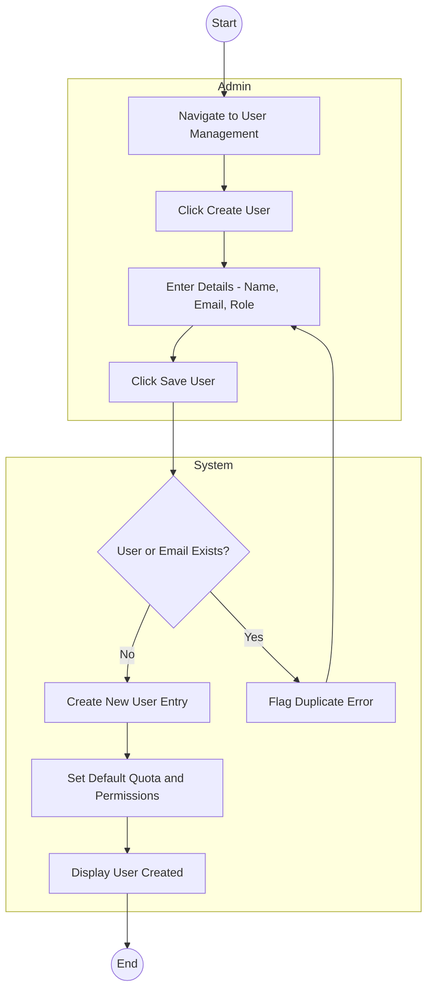

# Activity Diagram: Use case 16 (Create user)

```mermaid
graph TD
    Start((Start)) --> UserAction1

    subgraph Admin [Admin]
        UserAction1["Navigate to User Management"]
        UserAction2["Click Create User"]
        UserAction3["Enter Details - Name, Email, Role"]
        UserAction4["Click Save User"]
    end

    subgraph System [System]
        SysCheck1{"User or Email Exists?"}
        SysAction1["Create New User Entry"]
        SysAction2["Set Default Quota and Permissions"]
        SysAction3["Display User Created"]
        SysAction4["Flag Duplicate Error"]
    end

    UserAction1 --> UserAction2
    UserAction2 --> UserAction3
    UserAction3 --> UserAction4
    UserAction4 --> SysCheck1

    %% Duplicate Check
    SysCheck1 -- No --> SysAction1
    SysAction1 --> SysAction2
    SysAction2 --> SysAction3

    SysCheck1 -- Yes --> SysAction4
    SysAction4 --> UserAction3

    SysAction3 --> End((End))
```
