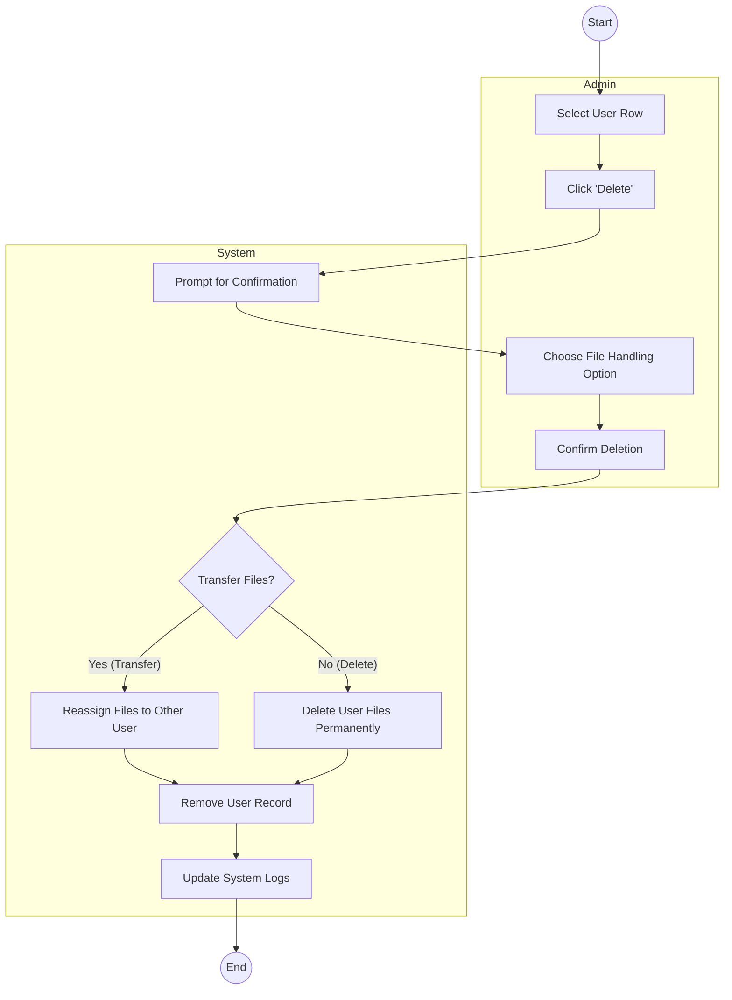

# Activity Diagram: Use case 18 (Delete user)

```mermaid
graph TD
    Start((Start)) --> UserAction1

    subgraph Admin [Admin]
        UserAction1[Select User Row]
        UserAction2[Click 'Delete']
        UserAction3[Choose File Handling Option]
        UserAction4[Confirm Deletion]
    end

    subgraph System [System]
        SysAction1[Prompt for Confirmation]
        SysCheck1{Transfer Files?}
        SysAction2[Reassign Files to Other User]
        SysAction3[Delete User Files Permanently]
        SysAction4[Remove User Record]
        SysAction5[Update System Logs]
    end

    UserAction1 --> UserAction2
    UserAction2 --> SysAction1
    SysAction1 --> UserAction3
    UserAction3 --> UserAction4
    UserAction4 --> SysCheck1

    %% File Handling Branch
    SysCheck1 -- Yes (Transfer) --> SysAction2
    SysCheck1 -- No (Delete) --> SysAction3
    
    SysAction2 --> SysAction4
    SysAction3 --> SysAction4
    SysAction4 --> SysAction5

    SysAction5 --> End((End))
```
