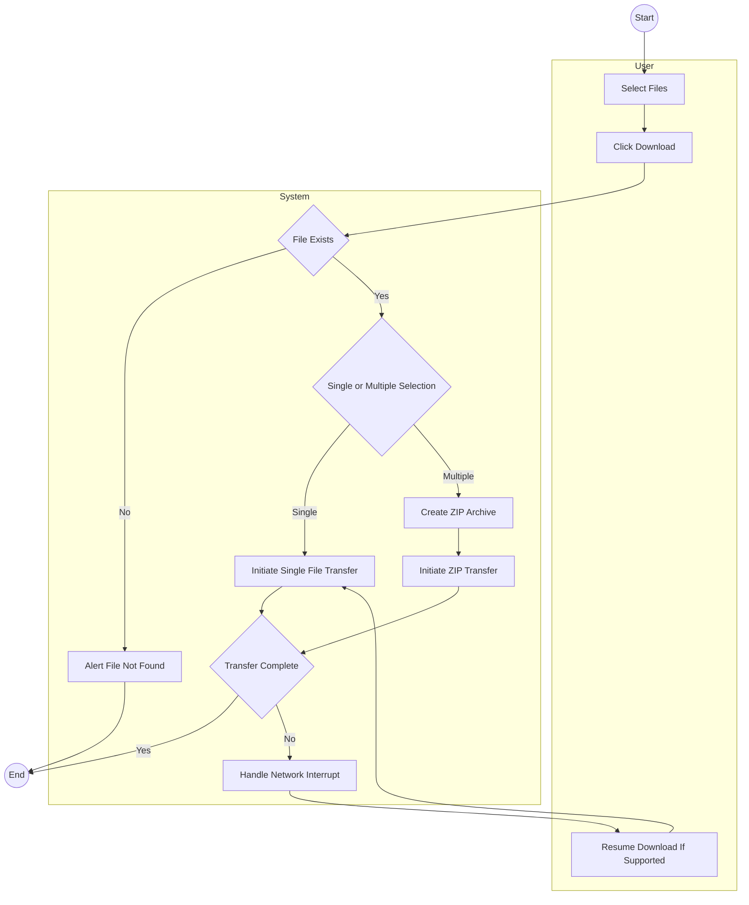

# Activity Diagram: UC_Download (Download Files)

```mermaid
graph TD
    Start((Start)) --> UserAction1

    subgraph User [User]
        UserAction1["Select Files"]
        UserAction2["Click Download"]
        UserAction3["Resume Download If Supported"]
    end

    subgraph System [System]
        SysCheckExists{"File Exists"}
        SysCheckType{"Single or Multiple Selection"}
        SysAction1["Initiate Single File Transfer"]
        SysAction2["Create ZIP Archive"]
        SysAction3["Initiate ZIP Transfer"]
        SysAction4["Alert File Not Found"]
        SysCheckTransfer{"Transfer Complete"}
        SysAction5["Handle Network Interrupt"]
    end

    UserAction1 --> UserAction2
    UserAction2 --> SysCheckExists

    %% Existence Check
    SysCheckExists -- No --> SysAction4
    SysAction4 --> End((End))

    SysCheckExists -- Yes --> SysCheckType

    %% Selection Type
    SysCheckType -- Single --> SysAction1
    SysCheckType -- Multiple --> SysAction2
    SysAction2 --> SysAction3

    %% Transfer Monitoring
    SysAction1 --> SysCheckTransfer
    SysAction3 --> SysCheckTransfer

    %% Completion / Error
    SysCheckTransfer -- Yes --> End
    SysCheckTransfer -- No --> SysAction5
    SysAction5 --> UserAction3
    UserAction3 --> SysAction1

```
