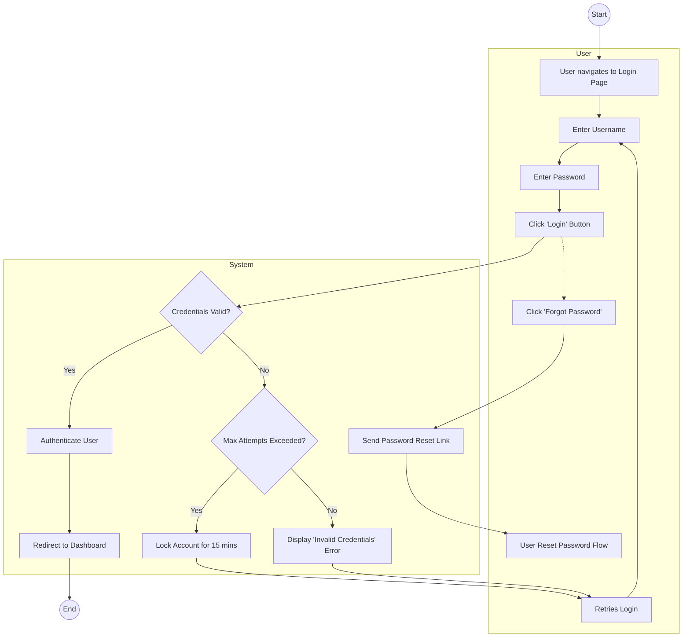

# Activity Diagram: UC_Login (Login)

```mermaid
graph TD
    Start((Start)) --> UserAction1[User navigates to Login Page]

    subgraph User [User]
        UserAction1
        UserAction2[Enter Username]
        UserAction3[Enter Password]
        UserAction4[Click 'Login' Button]
        UserAction5[Click 'Forgot Password']
        UserAction6[Retries Login]
        UserAction7[User Reset Password Flow]
    end

    subgraph System [System]
        SysCheck1{Credentials Valid?}
        SysAction1[Authenticate User]
        SysAction2[Redirect to Dashboard]
        SysAction3[Display 'Invalid Credentials' Error]
        SysCheck2{Max Attempts Exceeded?}
        SysAction4[Lock Account for 15 mins]
        SysAction5[Send Password Reset Link]
    end

    UserAction1 --> UserAction2
    UserAction2 --> UserAction3
    UserAction3 --> UserAction4

    UserAction4 --> SysCheck1
    
    %% Main success flow
    SysCheck1 -- Yes --> SysAction1
    SysAction1 --> SysAction2
    SysAction2 --> End((End))

    %% Exception Flows
    SysCheck1 -- No --> SysCheck2
    SysCheck2 -- Yes --> SysAction4
    SysAction4 --> UserAction6
    SysCheck2 -- No --> SysAction3
    SysAction3 --> UserAction6
    UserAction6 --> UserAction2

    %% Alternate Flow
    UserAction4 -.-> UserAction5
    UserAction5 --> SysAction5
    SysAction5 --> UserAction7
```
