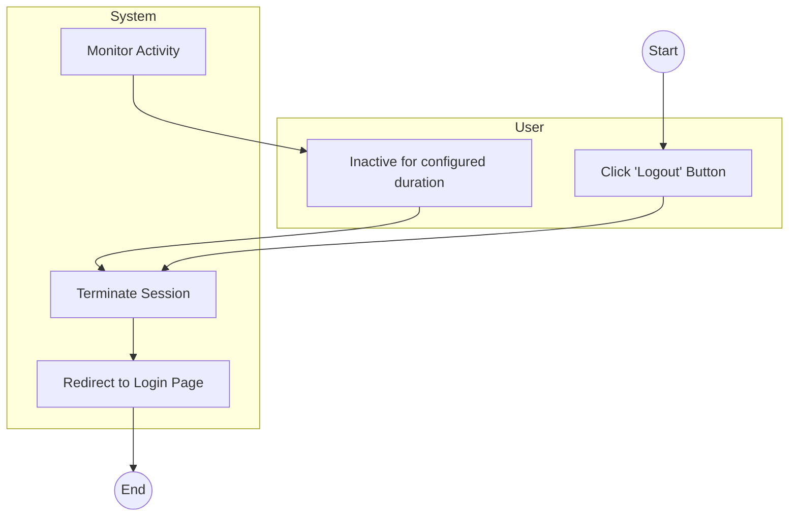

# Activity Diagram: UC_Logout (Logout)

```mermaid
graph TD
    Start((Start)) --> UserAction1

    subgraph User [User]
        UserAction1[Click 'Logout' Button]
        UserAction2[Inactive for configured duration]
    end

    subgraph System [System]
        SysAction1[Terminate Session]
        SysAction2[Redirect to Login Page]
        SysListener[Monitor Activity]
    end

    %% Standard Flow
    UserAction1 --> SysAction1
    SysAction1 --> SysAction2
    SysAction2 --> End((End))

    %% Auto-Logout Flow
    SysListener --> UserAction2
    UserAction2 --> SysAction1
```
