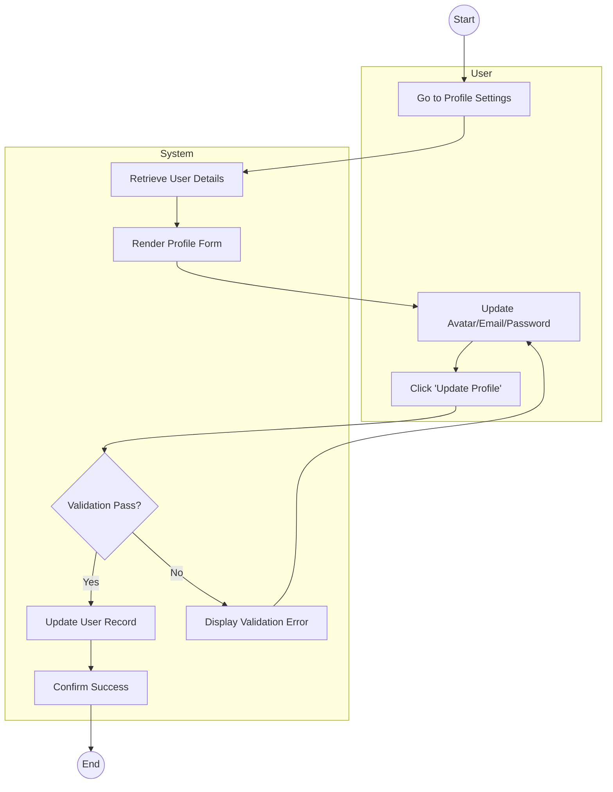

# Activity Diagram: UC_Profile (Update Profile)

```mermaid
graph TD
    Start((Start)) --> UserAction1

    subgraph User [User]
        UserAction1[Go to Profile Settings]
        UserAction2[Update Avatar/Email/Password]
        UserAction3[Click 'Update Profile']
    end

    subgraph System [System]
        SysAction1[Retrieve User Details]
        SysAction2[Render Profile Form]
        SysCheck1{Validation Pass?}
        SysAction3[Update User Record]
        SysAction4[Display Validation Error]
        SysAction5[Confirm Success]
    end

    UserAction1 --> SysAction1
    SysAction1 --> SysAction2
    SysAction2 --> UserAction2

    UserAction2 --> UserAction3
    UserAction3 --> SysCheck1

    %% Validation Check
    SysCheck1 -- Yes --> SysAction3
    SysAction3 --> SysAction5
    
    SysCheck1 -- No --> SysAction4
    SysAction4 --> UserAction2

    SysAction5 --> End((End))
```
