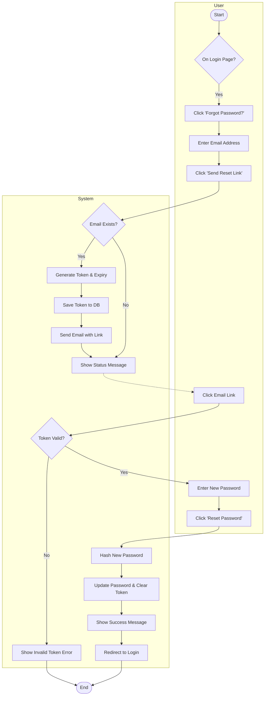

```mermaid
flowchart TD
    subgraph User
        Start([Start])
        IsLogin{On Login Page?}
        ClickForgot[Click 'Forgot Password?']
        EnterEmail[Enter Email Address]
        ClickSend[Click 'Send Reset Link']
        ClickEmailLink[Click Email Link]
        EnterNewPass[Enter New Password]
        ClickReset[Click 'Reset Password']
    end

    subgraph System
        Exists{Email Exists?}
        Generate[Generate Token & Expiry]
        Save[Save Token to DB]
        Email[Send Email with Link]
        ShowStatus[Show Status Message]
        ValidateToken{Token Valid?}
        ShowError[Show Invalid Token Error]
        Hash[Hash New Password]
        Update[Update Password & Clear Token]
        ShowSuccess[Show Success Message]
        DoRedirect[Redirect to Login]
    end

    Start --> IsLogin
    IsLogin -- Yes --> ClickForgot
    ClickForgot --> EnterEmail
    EnterEmail --> ClickSend
    ClickSend --> Exists

    Exists -- Yes --> Generate
    Generate --> Save
    Save --> Email
    Email --> ShowStatus
    Exists -- No --> ShowStatus

    ShowStatus -.-> ClickEmailLink
    ClickEmailLink --> ValidateToken

    ValidateToken -- No --> ShowError
    ShowError --> End([End])

    ValidateToken -- Yes --> EnterNewPass
    EnterNewPass --> ClickReset
    ClickReset --> Hash
    Hash --> Update
    Update --> ShowSuccess
    ShowSuccess --> DoRedirect
    DoRedirect --> End
```
