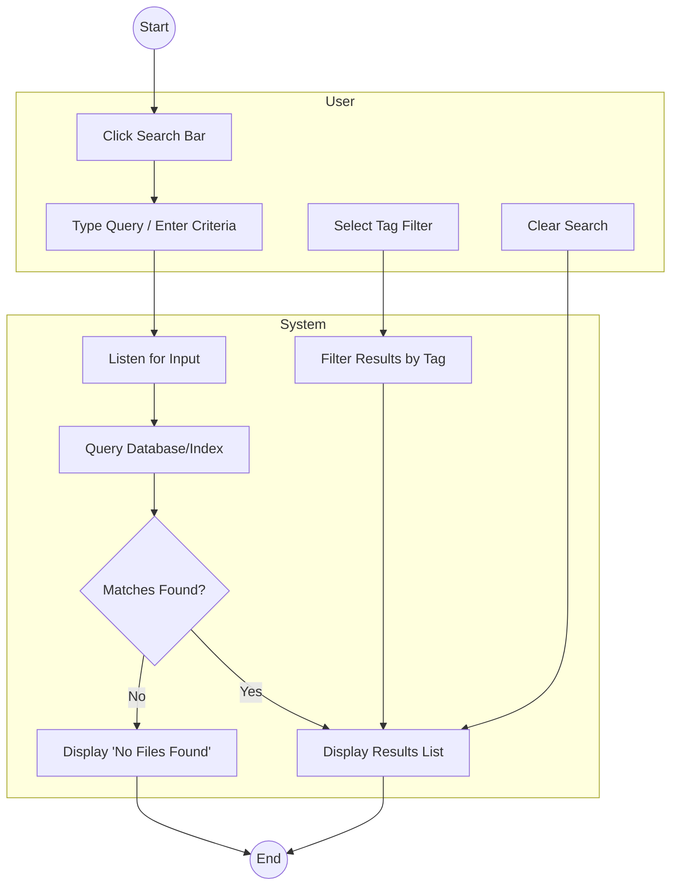

# Activity Diagram: UC_Search (Search Files)

```mermaid
graph TD
    Start((Start)) --> UserAction1

    subgraph User [User]
        UserAction1[Click Search Bar]
        UserAction2[Type Query / Enter Criteria]
        UserAction3[Select Tag Filter]
        UserAction4[Clear Search]
    end

    subgraph System [System]
        SysAction1[Listen for Input]
        SysAction2[Query Database/Index]
        SysCheck1{Matches Found?}
        SysAction3[Display Results List]
        SysAction4[Display 'No Files Found']
        SysAction5[Filter Results by Tag]
    end

    UserAction1 --> UserAction2
    UserAction2 --> SysAction1
    SysAction1 --> SysAction2
    SysAction2 --> SysCheck1

    %% Results Handling
    SysCheck1 -- Yes --> SysAction3
    SysCheck1 -- No --> SysAction4

    %% Tag Filtering
    UserAction3 --> SysAction5
    SysAction5 --> SysAction3

    %% Clear Search
    UserAction4 --> SysAction3
    
    SysAction3 --> End((End))
    SysAction4 --> End
```
