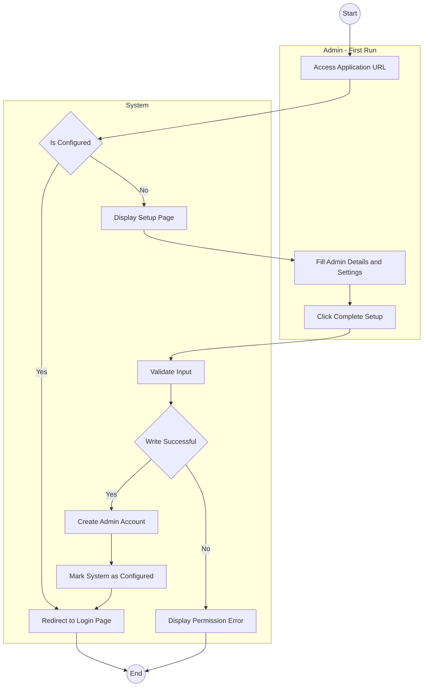

# Activity Diagram: UC_Setup (Initial Setup)

```mermaid
graph TD
    Start((Start)) --> UserAction1

    subgraph User ["Admin - First Run"]
        UserAction1["Access Application URL"]
        UserAction2["Fill Admin Details and Settings"]
        UserAction3["Click Complete Setup"]
    end

    subgraph System [System]
        SysCheck1{"Is Configured"}
        SysAction1["Display Setup Page"]
        SysAction2["Redirect to Login Page"]
        SysAction3["Validate Input"]
        SysCheck2{"Write Successful"}
        SysAction4["Create Admin Account"]
        SysAction5["Mark System as Configured"]
        SysAction6["Display Permission Error"]
    end

    UserAction1 --> SysCheck1

    %% Already configured check
    SysCheck1 -- Yes --> SysAction2
    SysAction2 --> End((End))

    %% Setup Flow
    SysCheck1 -- No --> SysAction1
    SysAction1 --> UserAction2
    UserAction2 --> UserAction3
    UserAction3 --> SysAction3
    SysAction3 --> SysCheck2

    %% Write Success
    SysCheck2 -- Yes --> SysAction4
    SysAction4 --> SysAction5
    SysAction5 --> SysAction2

    %% Write Failure
    SysCheck2 -- No --> SysAction6
    SysAction6 --> End((End))

```
