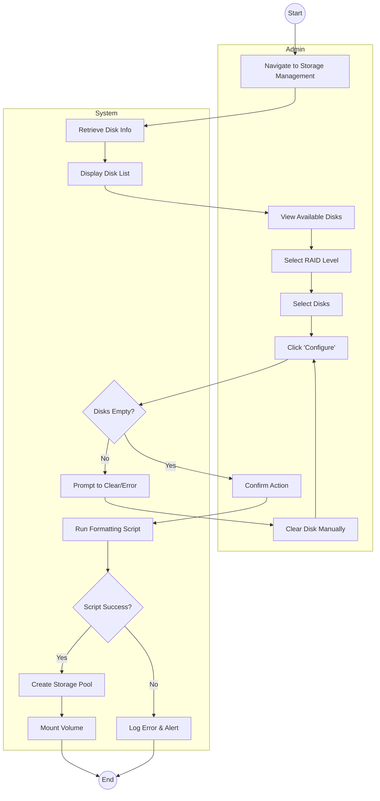

# Activity Diagram: UC_StorageMgmt (Storage Management)

```mermaid
graph TD
    Start((Start)) --> UserAction1

    subgraph User [Admin]
        UserAction1[Navigate to Storage Management]
        UserAction2[View Available Disks]
        UserAction3[Select RAID Level]
        UserAction4[Select Disks]
        UserAction5[Click 'Configure']
        UserAction6[Confirm Action]
        UserAction7[Clear Disk Manually]
    end

    subgraph System [System]
        SysAction1[Retrieve Disk Info]
        SysAction2[Display Disk List]
        SysCheck1{Disks Empty?}
        SysAction3[Prompt to Clear/Error]
        SysAction4[Run Formatting Script]
        SysCheck2{Script Success?}
        SysAction5[Create Storage Pool]
        SysAction6[Mount Volume]
        SysAction7[Log Error & Alert]
    end

    UserAction1 --> SysAction1
    SysAction1 --> SysAction2
    SysAction2 --> UserAction2
    UserAction2 --> UserAction3
    UserAction3 --> UserAction4
    UserAction4 --> UserAction5
    UserAction5 --> SysCheck1

    %% Disk Empty Check
    SysCheck1 -- No --> SysAction3
    SysAction3 --> UserAction7
    UserAction7 --> UserAction5
    
    %% Configuration Flow
    SysCheck1 -- Yes --> UserAction6
    UserAction6 --> SysAction4
    SysAction4 --> SysCheck2

    %% Success
    SysCheck2 -- Yes --> SysAction5
    SysAction5 --> SysAction6
    SysAction6 --> End((End))

    %% Failure
    SysCheck2 -- No --> SysAction7
    SysAction7 --> End
```
