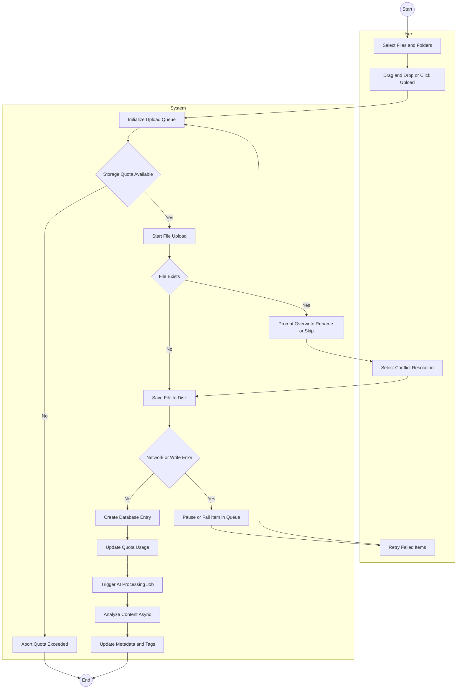

# Activity Diagram: UC_Upload (Upload Files)

```mermaid
graph TD
    Start((Start)) --> UserAction1

    subgraph User [User]
        UserAction1["Select Files and Folders"]
        UserAction2["Drag and Drop or Click Upload"]
        UserAction3["Select Conflict Resolution"]
        UserAction4["Retry Failed Items"]
    end

    subgraph System [System]
        SysActionInit["Initialize Upload Queue"]
        SysCheck1{"Storage Quota Available"}
        SysAction1["Start File Upload"]
        SysCheck2{"File Exists"}
        SysAction2["Prompt Overwrite Rename or Skip"]
        SysAction3["Save File to Disk"]
        SysAction4["Create Database Entry"]
        SysAction5["Update Quota Usage"]
        SysAction6["Abort Quota Exceeded"]
        SysCheck3{"Network or Write Error"}
        SysAction7["Pause or Fail Item in Queue"]

        %% AI Steps
        SysAction8["Trigger AI Processing Job"]
        SysAction9["Analyze Content Async"]
        SysAction10["Update Metadata and Tags"]
    end

    UserAction1 --> UserAction2
    UserAction2 --> SysActionInit
    SysActionInit --> SysCheck1

    %% Quota Check
    SysCheck1 -- No --> SysAction6
    SysAction6 --> End((End))

    %% Upload Start
    SysCheck1 -- Yes --> SysAction1
    SysAction1 --> SysCheck2

    %% Duplicate Check
    SysCheck2 -- Yes --> SysAction2
    SysAction2 --> UserAction3
    UserAction3 --> SysAction3
    SysCheck2 -- No --> SysAction3

    %% File Saving
    SysAction3 --> SysCheck3

    %% Error Handling
    SysCheck3 -- Yes --> SysAction7
    SysAction7 --> UserAction4
    UserAction4 --> SysActionInit

    %% Success & Post-Processing
    SysCheck3 -- No --> SysAction4
    SysAction4 --> SysAction5
    SysAction5 --> SysAction8
    SysAction8 --> SysAction9
    SysAction9 --> SysAction10
    SysAction10 --> End((End))
```
