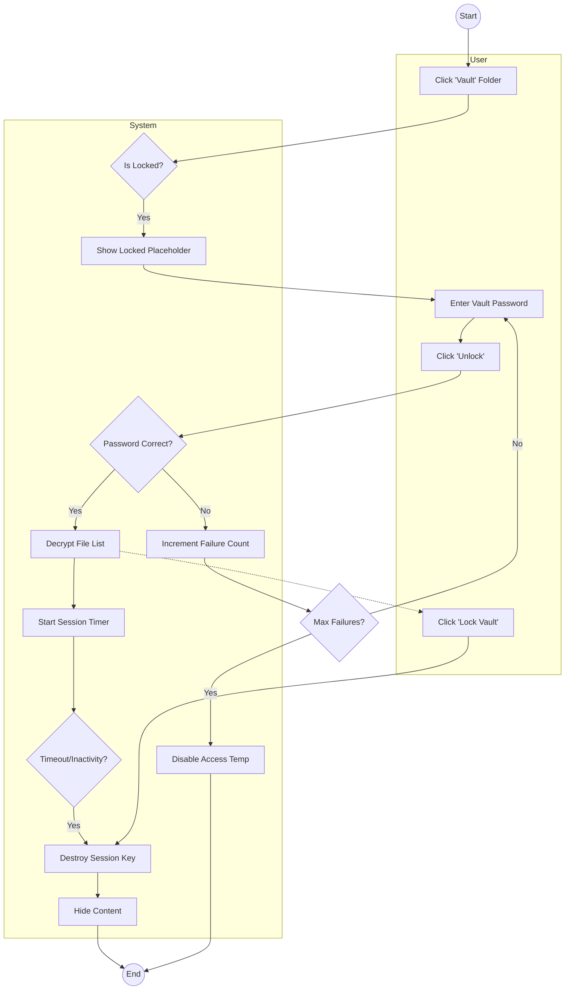

# Activity Diagram: UC_VaultLock (Encrypted File Access)

```mermaid
graph TD
    Start((Start)) --> UserAction1

    subgraph User [User]
        UserAction1[Click 'Vault' Folder]
        UserAction2[Enter Vault Password]
        UserAction3[Click 'Unlock']
        UserAction4[Click 'Lock Vault']
    end

    subgraph System [System]
        SysCheck1{Is Locked?}
        SysAction1[Show Locked Placeholder]
        SysCheck2{Password Correct?}
        SysAction2[Decrypt File List]
        SysAction3[Start Session Timer]
        SysAction4[Increment Failure Count]
        SysAction5[Disable Access Temp]
        SysAction6[Destroy Session Key]
        SysAction7[Hide Content]
        SysCheck3{Timeout/Inactivity?}
    end

    UserAction1 --> SysCheck1

    %% Locked State
    SysCheck1 -- Yes --> SysAction1
    SysAction1 --> UserAction2

    %% Unlock Attempt
    UserAction2 --> UserAction3
    UserAction3 --> SysCheck2

    %% Auth Check
    SysCheck2 -- Yes --> SysAction2
    SysAction2 --> SysAction3
    
    SysCheck2 -- No --> SysAction4
    SysAction4 --> SysCheckMax
    
    SysCheckMax{Max Failures?}
    SysCheckMax -- Yes --> SysAction5
    SysCheckMax -- No --> UserAction2

    %% Session Active
    SysAction3 --> SysCheck3
    SysCheck3 -- Yes --> SysAction6
    
    %% Manual Lock
    SysAction2 -.-> UserAction4
    UserAction4 --> SysAction6
    
    SysAction6 --> SysAction7
    SysAction7 --> End((End))
    SysAction5 --> End
```
