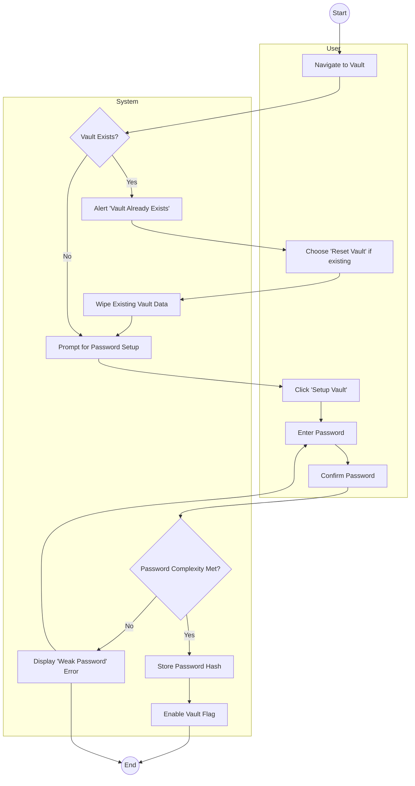

# Activity Diagram: UC_VaultSetup (Setup Vault)

```mermaid
graph TD
    Start((Start)) --> UserAction1

    subgraph User [User]
        UserAction1[Navigate to Vault]
        UserAction2[Click 'Setup Vault']
        UserAction3[Enter Password]
        UserAction4[Confirm Password]
        UserAction5[Choose 'Reset Vault' if existing]
    end

    subgraph System [System]
        SysCheck1{Vault Exists?}
        SysAction1[Prompt for Password Setup]
        SysAction2[Alert 'Vault Already Exists']
        SysCheck2{Password Complexity Met?}
        SysAction3[Store Password Hash]
        SysAction4[Enable Vault Flag]
        SysAction5[Display 'Weak Password' Error]
        SysAction6[Wipe Existing Vault Data]
    end

    UserAction1 --> SysCheck1

    %% Existing Check
    SysCheck1 -- Yes --> SysAction2
    SysAction2 --> UserAction5
    UserAction5 --> SysAction6
    SysAction6 --> SysAction1

    SysCheck1 -- No --> SysAction1
    SysAction1 --> UserAction2

    %% Setup Flow
    UserAction2 --> UserAction3
    UserAction3 --> UserAction4
    UserAction4 --> SysCheck2

    %% Validation
    SysCheck2 -- Yes --> SysAction3
    SysAction3 --> SysAction4
    
    SysCheck2 -- No --> SysAction5
    SysAction5 --> UserAction3

    SysAction4 --> End((End))
    SysAction5 --> End
```
