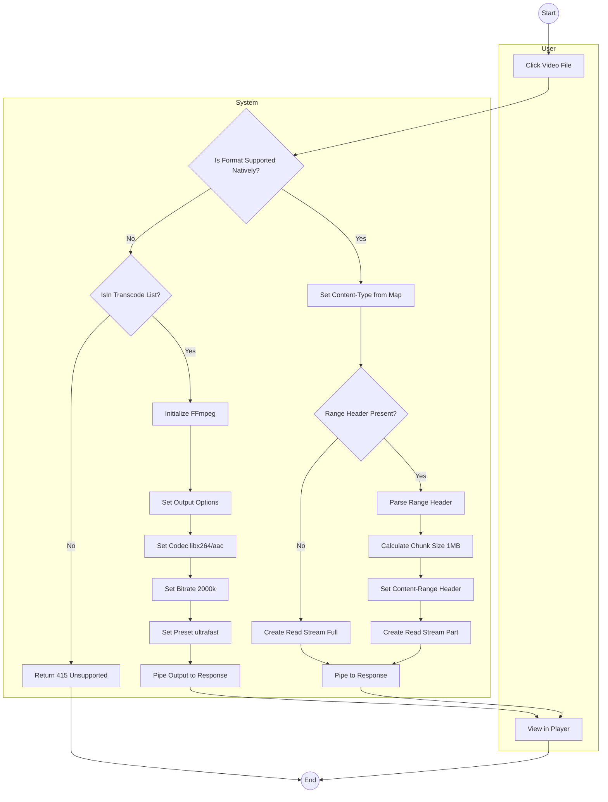

# Activity Diagram: UC_View (View/Stream Media)

```mermaid
graph TD
    Start((Start)) --> UserAction1

    subgraph User [User]
        UserAction1[Click Video File]
        UserAction2[View in Player]
    end

    subgraph System [System]
        SysCheck1{Is Format Supported Natively?}
        
        %% Direct Stream Branch
        SysAction3[Set Content-Type from Map]
        SysCheck2{Range Header Present?}
        SysAction4[Parse Range Header]
        SysAction5[Calculate Chunk Size 1MB]
        SysAction6[Set Content-Range Header]
        SysAction7[Create Read Stream Part]
        SysAction8[Create Read Stream Full]
        SysAction9[Pipe to Response]

        %% Transcoding Branch
        SysCheck3{IsIn Transcode List?}
        SysAction10[Initialize FFmpeg]
        SysAction11[Set Output Options]
        SysAction12[Set Codec libx264/aac]
        SysAction13[Set Bitrate 2000k]
        SysAction14[Set Preset ultrafast]
        SysAction15[Pipe Output to Response]
        SysActionError[Return 415 Unsupported]
    end

    UserAction1 --> SysCheck1

    %% Native Support Check (mp4, webm, ogg)
    SysCheck1 -- Yes --> SysAction3
    SysAction3 --> SysCheck2

    %% Range Handling
    SysCheck2 -- Yes --> SysAction4
    SysAction4 --> SysAction5
    SysAction5 --> SysAction6
    SysAction6 --> SysAction7
    SysAction7 --> SysAction9

    SysCheck2 -- No --> SysAction8
    SysAction8 --> SysAction9

    %% Transcoding (mkv, avi, mov, etc.)
    SysCheck1 -- No --> SysCheck3
    SysCheck3 -- Yes --> SysAction10
    SysAction10 --> SysAction11
    SysAction11 --> SysAction12
    SysAction12 --> SysAction13
    SysAction13 --> SysAction14
    SysAction14 --> SysAction15

    %% Error Handling
    SysCheck3 -- No --> SysActionError
    
    SysAction9 --> UserAction2
    SysAction15 --> UserAction2
    SysActionError --> End((End))
    UserAction2 --> End
```
