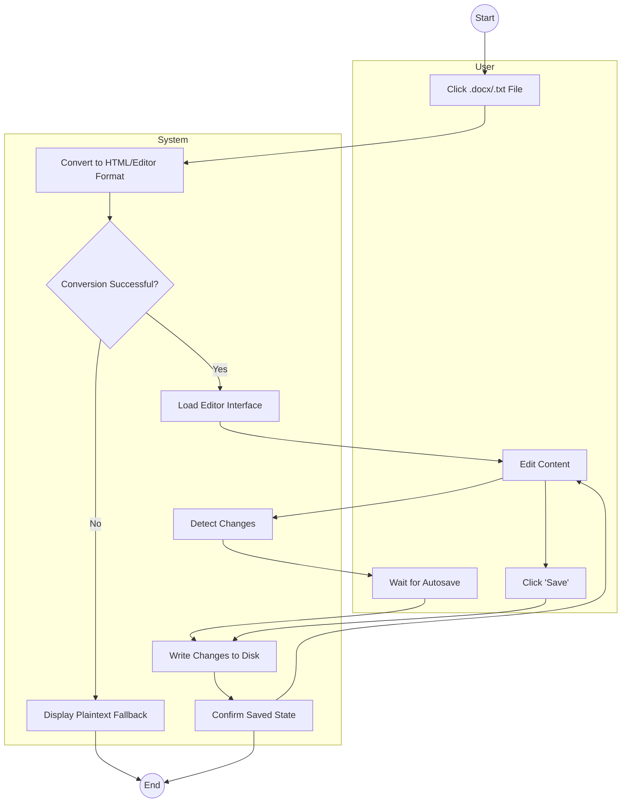

# Activity Diagram: UC_docx (View/Edit Document)

```mermaid
graph TD
    Start((Start)) --> UserAction1

    subgraph User [User]
        UserAction1[Click .docx/.txt File]
        UserAction2[Edit Content]
        UserAction3[Click 'Save']
        UserAction4[Wait for Autosave]
    end

    subgraph System [System]
        SysCheck1{Conversion Successful?}
        SysAction1[Convert to HTML/Editor Format]
        SysAction2[Load Editor Interface]
        SysAction3[Display Plaintext Fallback]
        SysAction4[Detect Changes]
        SysAction5[Write Changes to Disk]
        SysAction6[Confirm Saved State]
    end

    UserAction1 --> SysAction1
    SysAction1 --> SysCheck1

    %% Conversion Check
    SysCheck1 -- Yes --> SysAction2
    SysCheck1 -- No --> SysAction3

    %% Edit Loop
    SysAction2 --> UserAction2
    UserAction2 --> SysAction4
    
    %% Saving
    SysAction4 --> UserAction4
    UserAction4 --> SysAction5
    
    UserAction2 --> UserAction3
    UserAction3 --> SysAction5
    
    SysAction5 --> SysAction6
    SysAction6 --> UserAction2

    SysAction3 --> End((End))
    SysAction6 --> End
```
