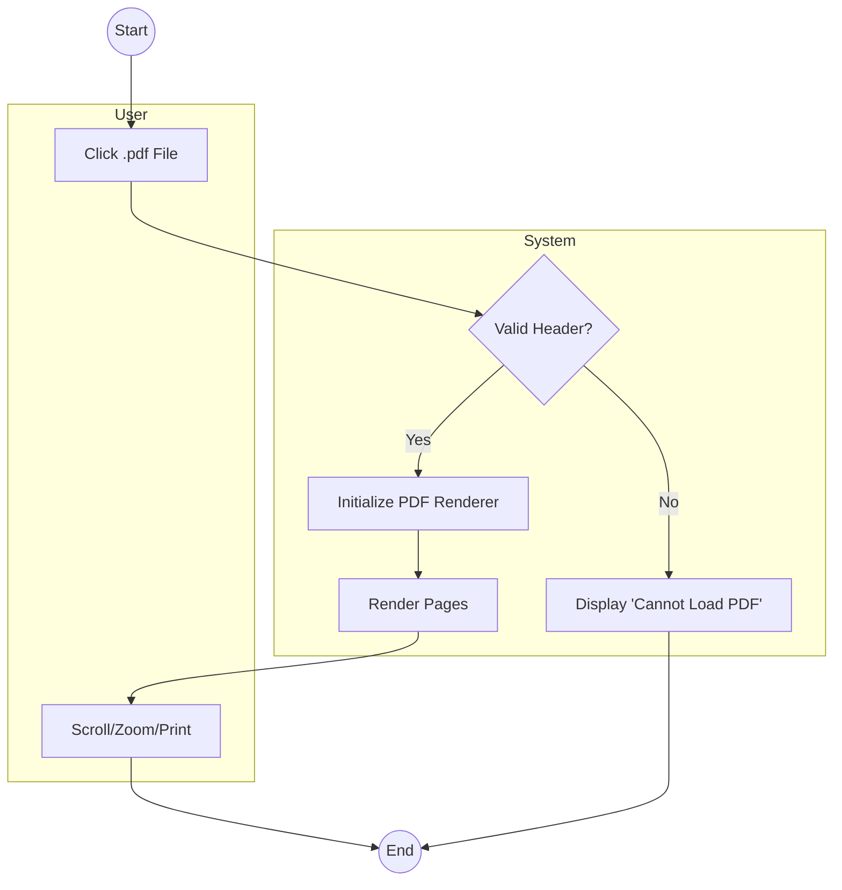

# Activity Diagram: UC_pdf (View PDF)

```mermaid
graph TD
    Start((Start)) --> UserAction1

    subgraph User [User]
        UserAction1[Click .pdf File]
        UserAction2[Scroll/Zoom/Print]
    end

    subgraph System [System]
        SysCheck1{Valid Header?}
        SysAction1[Initialize PDF Renderer]
        SysAction2[Render Pages]
        SysAction3[Display 'Cannot Load PDF']
    end

    UserAction1 --> SysCheck1

    %% Validity Check
    SysCheck1 -- Yes --> SysAction1
    SysAction1 --> SysAction2
    SysAction2 --> UserAction2

    SysCheck1 -- No --> SysAction3
    
    UserAction2 --> End((End))
    SysAction3 --> End
```
