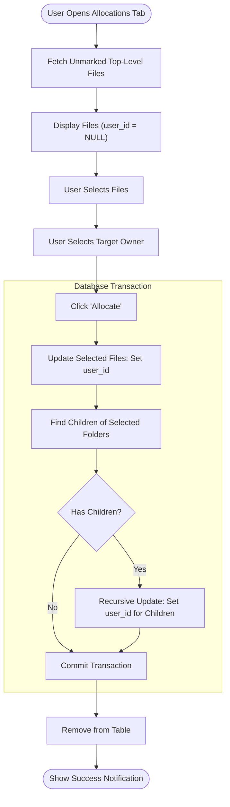

# Allocation of Unmarked Files

This diagram represents the workflow for the "Allocations" tab, where users claim files that exist on disk but have no owner in the database.

```mermaid
flowchart TD
    Start([User Opens Allocations Tab]) --> Fetch[Fetch Unmarked Top-Level Files]
    Fetch --> DisplayTable["Display Files (user_id = NULL)"]
    
    DisplayTable --> Select[User Selects Files]
    Select --> ChooseUser[User Selects Target Owner]
    ChooseUser --> Click[Click 'Allocate']
    
    subgraph Transaction [Database Transaction]
        Click --> Direct[Update Selected Files: Set user_id]
        Direct --> FindChildren[Find Children of Selected Folders]
        FindChildren --> Loop{Has Children?}
        Loop -- Yes --> Recurse[Recursive Update: Set user_id for Children]
        Loop -- No --> Commit[Commit Transaction]
        Recurse --> Commit
    end
    
    Commit --> UI_Update[Remove from Table]
    UI_Update --> Toast([Show Success Notification])
```
