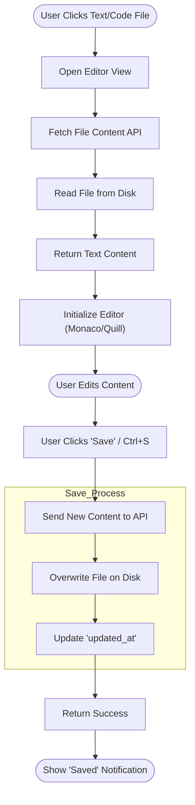

# Document Editor

This diagram illustrates the flow for viewing and editing text/code documents.

```mermaid
flowchart TD
    Start([User Clicks Text/Code File]) --> OpenEditor[Open Editor View]
    OpenEditor --> API_Read[Fetch File Content API]
    
    API_Read --> ReadDisk[Read File from Disk]
    ReadDisk --> ReturnTxt[Return Text Content]
    
    ReturnTxt --> InitEditor["Initialize Editor (Monaco/Quill)"]
    InitEditor --> Display([User Edits Content])
    
    Display --> SaveCmd[User Clicks 'Save' / Ctrl+S]
    SaveCmd --> API_Write[Send New Content to API]
    
    subgraph Save_Process
        API_Write --> WriteDisk[Overwrite File on Disk]
        WriteDisk --> UpdateMeta[Update 'updated_at']
    end
    
    UpdateMeta --> Success[Return Success]
    Success --> Toast([Show 'Saved' Notification])
```
