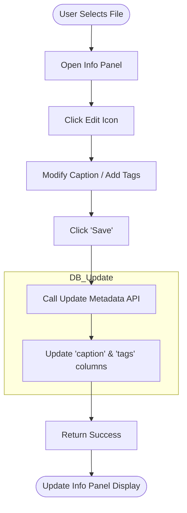

# File Edit Metadata

This diagram illustrates editing file metadata like Captions and Tags.

```mermaid
flowchart TD
    Start([User Selects File]) --> ClickInfo[Open Info Panel]
    ClickInfo --> Edit[Click Edit Icon]
    
    Edit --> Inputs[Modify Caption / Add Tags]
    Inputs --> Save[Click 'Save']
    
    Save --> API[Call Update Metadata API]
    
    subgraph DB_Update
        API --> UpdateRow[Update 'caption' & 'tags' columns]
    end
    
    UpdateRow --> Success[Return Success]
    Success --> UI([Update Info Panel Display])
```
