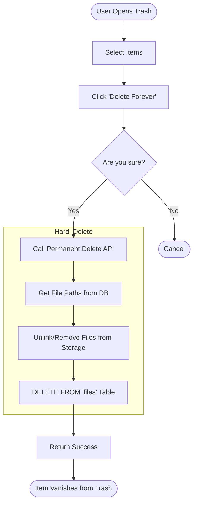

# File/Folder Permanent Delete

This diagram illustrates permanently deleting items from the Trash/Recently Deleted area.

```mermaid
flowchart TD
    Start([User Opens Trash]) --> Select[Select Items]
    Select --> ClickPerm[Click 'Delete Forever']
    
    ClickPerm --> Confirm{Are you sure?}
    Confirm -- No --> Cancel([Cancel])
    
    Confirm -- Yes --> API[Call Permanent Delete API]
    
    subgraph Hard_Delete
        API --> FetchPaths[Get File Paths from DB]
        FetchPaths --> DeleteDisk[Unlink/Remove Files from Storage]
        DeleteDisk --> DeleteDB[DELETE FROM 'files' Table]
    end
    
    DeleteDB --> Success[Return Success]
    Success --> UI([Item Vanishes from Trash])
```
