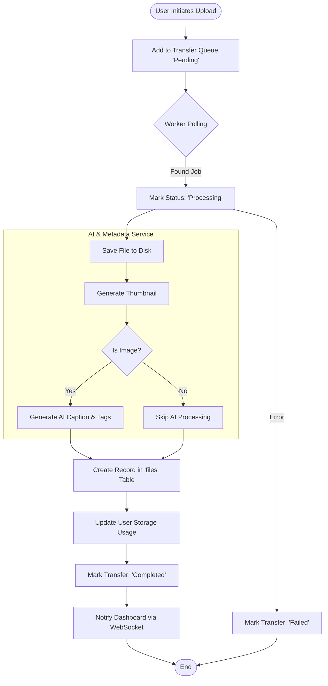

# File Upload & Processing Workflow

This diagram illustrates the lifecycle of a file upload, including the background transfer queue and AI captioning/metadata steps.

```mermaid
flowchart TD
    Start([User Initiates Upload]) --> Queue[Add to Transfer Queue 'Pending']
    Queue --> Poll{Worker Polling}
    Poll -->|Found Job| Process[Mark Status: 'Processing']
    Process --> Save[Save File to Disk]
    
    subgraph AI_Processing [AI & Metadata Service]
        Save --> Thumb[Generate Thumbnail]
        Thumb --> CheckImg{Is Image?}
        CheckImg -- Yes --> Caption[Generate AI Caption & Tags]
        CheckImg -- No --> SkipAI[Skip AI Processing]
    end
    
    Caption --> DB_Entry
    SkipAI --> DB_Entry
    
    DB_Entry[Create Record in 'files' Table] --> UpdateUser[Update User Storage Usage]
    UpdateUser --> Complete[Mark Transfer: 'Completed']
    Complete --> Notify[Notify Dashboard via WebSocket]
    Notify --> Stop([End])
    
    Process -- Error --> Failed[Mark Transfer: 'Failed']
    Failed --> Stop
```
