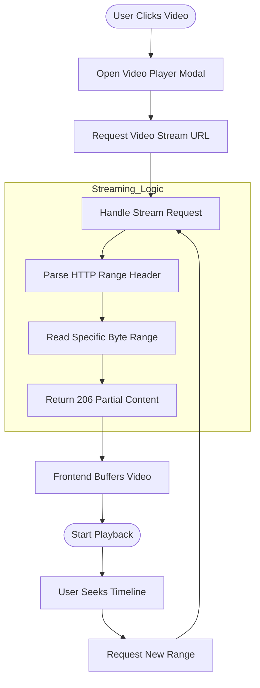

# Video Streaming

This diagram illustrates the flow for streaming video files.

```mermaid
flowchart TD
    Start([User Clicks Video]) --> Player[Open Video Player Modal]
    Player --> Request[Request Video Stream URL]
    
    Request --> Backend[Handle Stream Request]
    
    subgraph Streaming_Logic
        Backend --> ParseRange[Parse HTTP Range Header]
        ParseRange --> ReadChunk[Read Specific Byte Range]
        ReadChunk --> StreamRes[Return 206 Partial Content]
    end
    
    StreamRes --> Buffer[Frontend Buffers Video]
    Buffer --> Play([Start Playback])
    
    Play --> Seek[User Seeks Timeline]
    Seek --> RequestNew[Request New Range]
    RequestNew --> Backend
```
