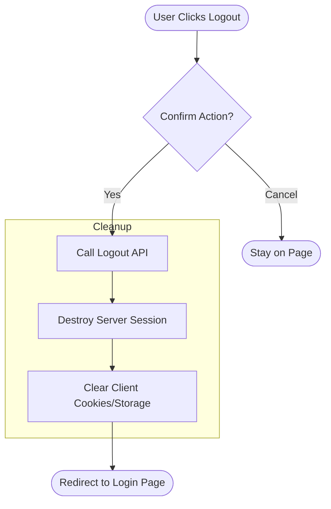

# Logout Workflow

This diagram illustrates the user logout process.

```mermaid
flowchart TD
    Start([User Clicks Logout]) --> Confirm{Confirm Action?}
    
    Confirm -- Cancel --> CancelAction([Stay on Page])
    
    Confirm -- Yes --> CallAPI[Call Logout API]
    
    subgraph Cleanup
        CallAPI --> DestroySession[Destroy Server Session]
        DestroySession --> ClearCookies[Clear Client Cookies/Storage]
    end
    
    ClearCookies --> Redirect([Redirect to Login Page])
```
