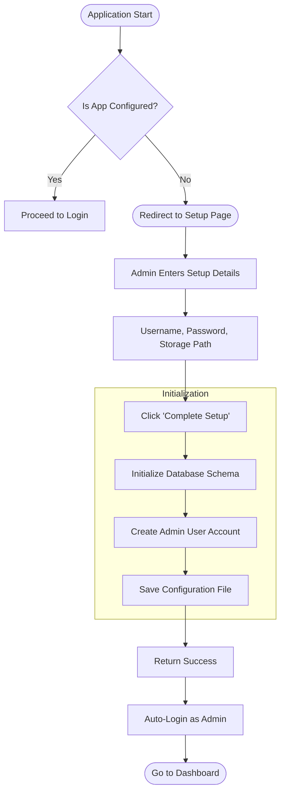

# Setup Process Workflow

This diagram illustrates the initial setup process for the application (first run).

```mermaid
flowchart TD
    Start([Application Start]) --> CheckConfig{Is App Configured?}
    
    CheckConfig -- Yes --> Normal[Proceed to Login]
    
    CheckConfig -- No --> RedirectSetup([Redirect to Setup Page])
    
    RedirectSetup --> Input[Admin Enters Setup Details]
    Input --> Details[Username, Password, Storage Path]
    
    Details --> Submit[Click 'Complete Setup']
    
    subgraph Initialization
        Submit --> CreateDB[Initialize Database Schema]
        CreateDB --> CreateAdmin[Create Admin User Account]
        CreateAdmin --> SaveConfig[Save Configuration File]
    end
    
    SaveConfig --> Success[Return Success]
    Success --> AutoLogin[Auto-Login as Admin]
    AutoLogin --> Dashboard([Go to Dashboard])
```
