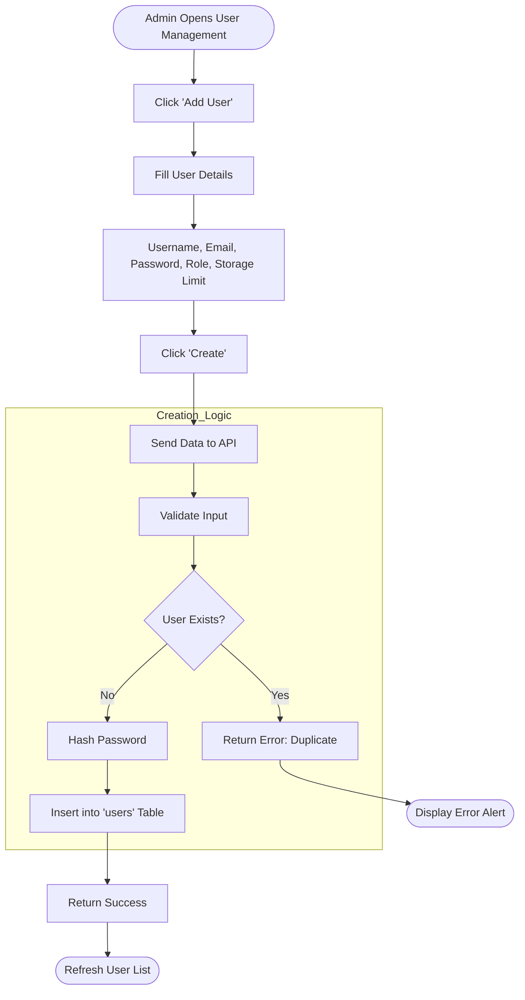

# User Management: Create User

This diagram illustrates the workflow for an Admin creating a new user.

```mermaid
flowchart TD
    Start([Admin Opens User Management]) --> ClickNew[Click 'Add User']
    ClickNew --> Form[Fill User Details]
    Form --> Details[Username, Email, Password, Role, Storage Limit]
    
    Details --> Submit[Click 'Create']
    Submit --> API[Send Data to API]
    
    subgraph Creation_Logic
        API --> Validate[Validate Input]
        Validate --> CheckDup{User Exists?}
        
        CheckDup -- Yes --> Error[Return Error: Duplicate]
        
        CheckDup -- No --> Hash[Hash Password]
        Hash --> Insert[Insert into 'users' Table]
    end
    
    Error --> ShowErr([Display Error Alert])
    Insert --> Success[Return Success]
    Success --> Refresh([Refresh User List])
```
