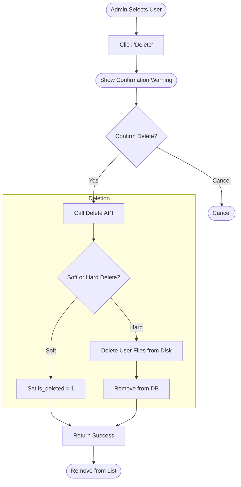

# User Management: Delete User

This diagram illustrates the workflow for deleting a user account.

```mermaid
flowchart TD
    Start([Admin Selects User]) --> ClickDelete[Click 'Delete']
    ClickDelete --> Warning([Show Confirmation Warning])
    
    Warning --> Confirm{Confirm Delete?}
    Confirm -- Cancel --> Stop([Cancel])
    
    Confirm -- Yes --> API[Call Delete API]
    
    subgraph Deletion
        API --> SoftDel{Soft or Hard Delete?}
        
        SoftDel -- Soft --> Flag[Set is_deleted = 1]
        
        SoftDel -- Hard --> RemoveFiles[Delete User Files from Disk]
        RemoveFiles --> CleanDB[Remove from DB]
    end
    
    Flag --> RetSuccess[Return Success]
    CleanDB --> RetSuccess
    
    RetSuccess --> UI_Update([Remove from List])
```
