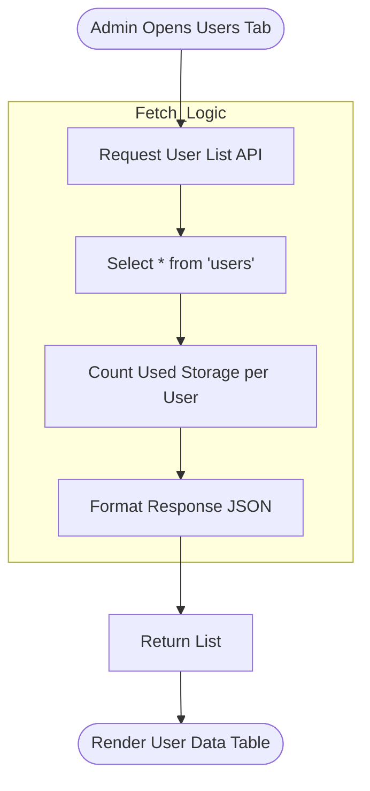

# User Management: View Users

This diagram illustrates the workflow for listing users.

```mermaid
flowchart TD
    Start([Admin Opens Users Tab]) --> Request[Request User List API]
    
    subgraph Fetch_Logic
        Request --> Query[Select * from 'users']
        Query --> Count[Count Used Storage per User]
        Count --> Format[Format Response JSON]
    end
    
    Format --> Response[Return List]
    Response --> Render([Render User Data Table])
```
