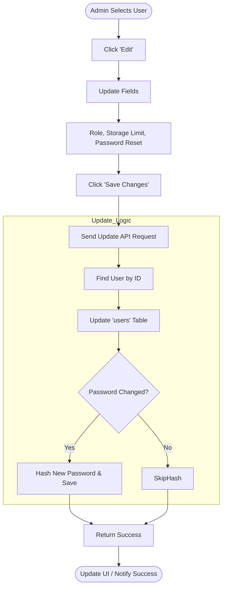

# User Management: Update User

This diagram illustrates the workflow for modifying existing user details.

```mermaid
flowchart TD
    Start([Admin Selects User]) --> ClickEdit[Click 'Edit']
    ClickEdit --> Form[Update Fields]
    Form --> Fields[Role, Storage Limit, Password Reset]
    
    Fields --> Submit[Click 'Save Changes']
    Submit --> API[Send Update API Request]
    
    subgraph Update_Logic
        API --> Find[Find User by ID]
        Find --> UpdateDB[Update 'users' Table]
        UpdateDB --> CheckPass{Password Changed?}
        
        CheckPass -- Yes --> ReHash[Hash New Password & Save]
        CheckPass -- No --> SkipHash
    end
    
    ReHash --> Success[Return Success]
    SkipHash --> Success
    Success --> UI([Update UI / Notify Success])
```
