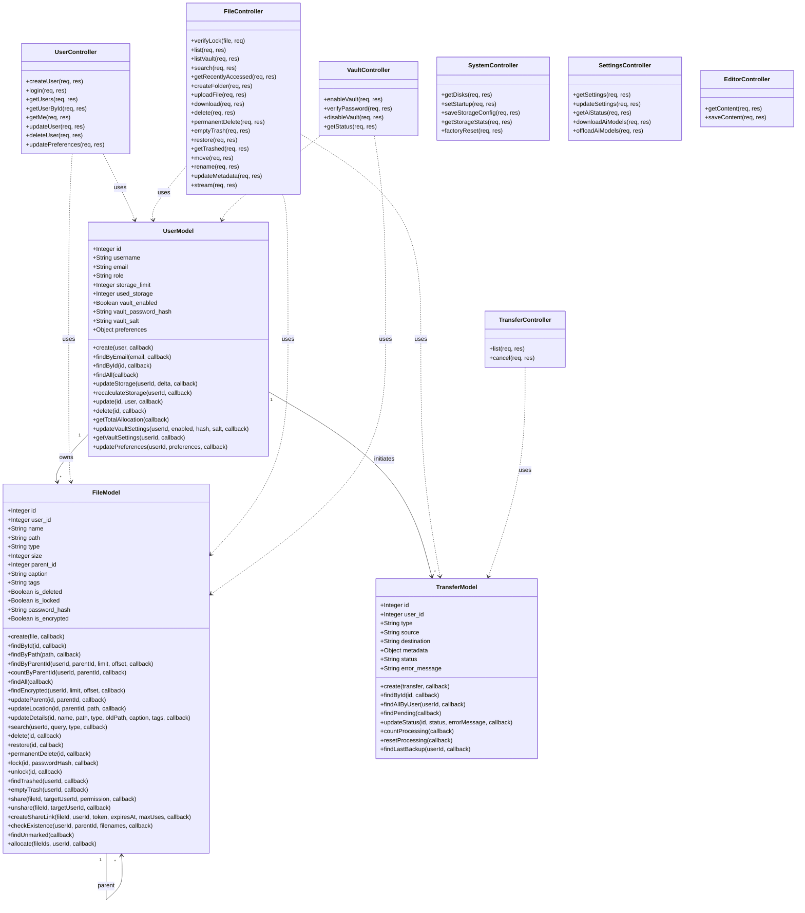

# Class Diagram

This document contains the class diagram for the NAS 2.0 application, illustrating the relationships between Models (Data Layer) and Controllers (Logic Layer).

## Diagram

```mermaid
classDiagram
    %% Relationships
    UserModel "1" --> "*" FileModel : owns
    UserModel "1" --> "*" TransferModel : initiates
    
    %% Implicit Relationships from DB Foreign Keys
    %% Share Relationships managed via join tables or logic
    FileModel "1" --> "*" FileModel : parent
    
    %% Controllers use Models
    UserController ..> UserModel : uses
    UserController ..> FileModel : uses
    FileController ..> FileModel : uses
    FileController ..> TransferModel : uses
    FileController ..> UserModel : uses
    VaultController ..> UserModel : uses
    VaultController ..> FileModel : uses
    TransferController ..> TransferModel : uses

    class UserModel {
        +Integer id
        +String username
        +String email
        +String role
        +Integer storage_limit
        +Integer used_storage
        +Boolean vault_enabled
        +String vault_password_hash
        +String vault_salt
        +Object preferences
        +create(user, callback)
        +findByEmail(email, callback)
        +findById(id, callback)
        +findAll(callback)
        +updateStorage(userId, delta, callback)
        +recalculateStorage(userId, callback)
        +update(id, user, callback)
        +delete(id, callback)
        +getTotalAllocation(callback)
        +updateVaultSettings(userId, enabled, hash, salt, callback)
        +getVaultSettings(userId, callback)
        +updatePreferences(userId, preferences, callback)
    }

    class FileModel {
        +Integer id
        +Integer user_id
        +String name
        +String path
        +String type
        +Integer size
        +Integer parent_id
        +String caption
        +String tags
        +Boolean is_deleted
        +Boolean is_locked
        +String password_hash
        +Boolean is_encrypted
        +create(file, callback)
        +findById(id, callback)
        +findByPath(path, callback)
        +findByParentId(userId, parentId, limit, offset, callback)
        +countByParentId(userId, parentId, callback)
        +findAll(callback)
        +findEncrypted(userId, limit, offset, callback)
        +updateParent(id, parentId, callback)
        +updateLocation(id, parentId, path, callback)
        +updateDetails(id, name, path, type, oldPath, caption, tags, callback)
        +search(userId, query, type, callback)
        +delete(id, callback)
        +restore(id, callback)
        +permanentDelete(id, callback)
        +lock(id, passwordHash, callback)
        +unlock(id, callback)
        +findTrashed(userId, callback)
        +emptyTrash(userId, callback)
        +share(fileId, targetUserId, permission, callback)
        +unshare(fileId, targetUserId, callback)
        +createShareLink(fileId, userId, token, expiresAt, maxUses, callback)
        +checkExistence(userId, parentId, filenames, callback)
        +findUnmarked(callback)
        +allocate(fileIds, userId, callback)
    }

    class TransferModel {
        +Integer id
        +Integer user_id
        +String type
        +String source
        +String destination
        +Object metadata
        +String status
        +String error_message
        +create(transfer, callback)
        +findById(id, callback)
        +findAllByUser(userId, callback)
        +findPending(callback)
        +updateStatus(id, status, errorMessage, callback)
        +countProcessing(callback)
        +resetProcessing(callback)
        +findLastBackup(userId, callback)
    }

    class UserController {
        +createUser(req, res)
        +login(req, res)
        +getUsers(req, res)
        +getUserById(req, res)
        +getMe(req, res)
        +updateUser(req, res)
        +deleteUser(req, res)
        +updatePreferences(req, res)
    }

    class FileController {
        +verifyLock(file, req)
        +list(req, res)
        +listVault(req, res)
        +search(req, res)
        +getRecentlyAccessed(req, res)
        +createFolder(req, res)
        +uploadFile(req, res)
        +download(req, res)
        +delete(req, res)
        +permanentDelete(req, res)
        +emptyTrash(req, res)
        +restore(req, res)
        +getTrashed(req, res)
        +move(req, res)
        +rename(req, res)
        +updateMetadata(req, res)
        +stream(req, res)
    }

    class VaultController {
        +enableVault(req, res)
        +verifyPassword(req, res)
        +disableVault(req, res)
        +getStatus(req, res)
    }

    class TransferController {
        +list(req, res)
        +cancel(req, res)
    }
    
    class SystemController {
        +getDisks(req, res)
        +setStartup(req, res)
        +saveStorageConfig(req, res)
        +getStorageStats(req, res)
        +factoryReset(req, res)
    }
    
    class SettingsController {
        +getSettings(req, res)
        +updateSettings(req, res)
        +getAiStatus(req, res)
        +downloadAiModels(req, res)
        +offloadAiModels(req, res)
    }
    
    class EditorController {
        +getContent(req, res)
        +saveContent(req, res)
    }
```
