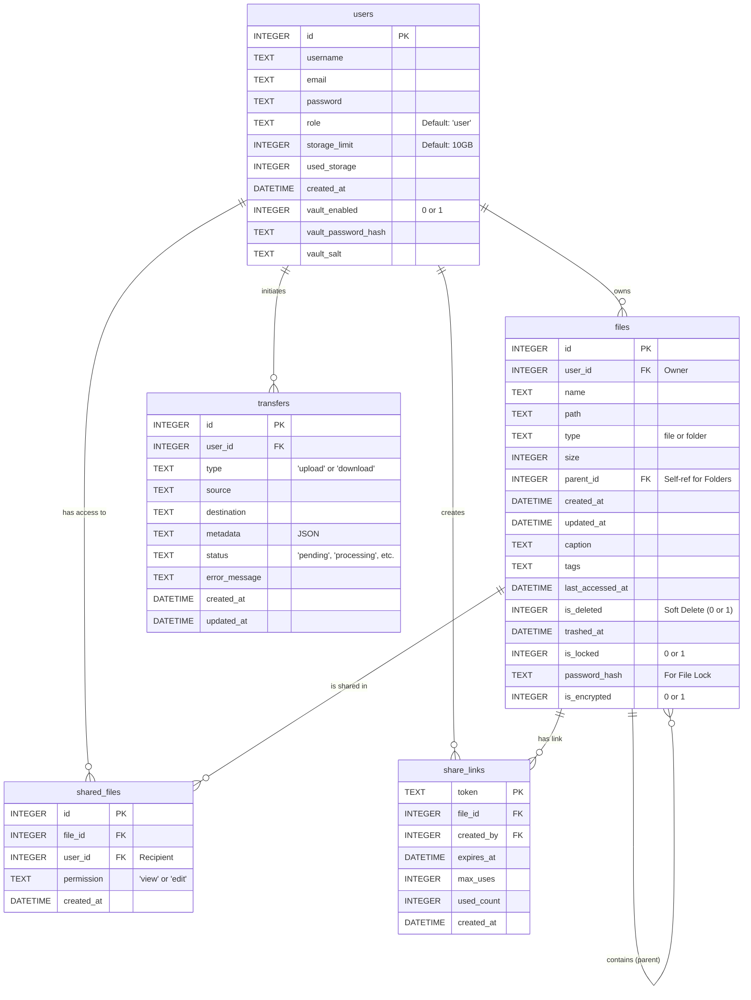

# Entity Relationship Diagram (ERD)

This diagram represents the database schema for the NAS 2.0 application.

```mermaid
erDiagram
    %% Relationships
    users ||--o{ files : "owns"
    users ||--o{ shared_files : "has access to"
    users ||--o{ transfers : "initiates"
    users ||--o{ share_links : "creates"

    files ||--o{ files : "contains (parent)"
    files ||--o{ shared_files : "is shared in"
    files ||--o{ share_links : "has link"

    %% Table Definitions
    users {
        INTEGER id PK
        TEXT username
        TEXT email
        TEXT password
        TEXT role "Default: 'user'"
        INTEGER storage_limit "Default: 10GB"
        INTEGER used_storage
        DATETIME created_at
        INTEGER vault_enabled "0 or 1"
        TEXT vault_password_hash
        TEXT vault_salt
    }

    files {
        INTEGER id PK
        INTEGER user_id FK "Owner"
        TEXT name
        TEXT path
        TEXT type "file or folder"
        INTEGER size
        INTEGER parent_id FK "Self-ref for Folders"
        DATETIME created_at
        DATETIME updated_at
        TEXT caption
        TEXT tags
        DATETIME last_accessed_at
        INTEGER is_deleted "Soft Delete (0 or 1)"
        DATETIME trashed_at
        INTEGER is_locked "0 or 1"
        TEXT password_hash "For File Lock"
        INTEGER is_encrypted "0 or 1"
    }

    shared_files {
        INTEGER id PK
        INTEGER file_id FK
        INTEGER user_id FK "Recipient"
        TEXT permission "'view' or 'edit'"
        DATETIME created_at
    }

    share_links {
        TEXT token PK
        INTEGER file_id FK
        INTEGER created_by FK
        DATETIME expires_at
        INTEGER max_uses
        INTEGER used_count
        DATETIME created_at
    }

    transfers {
        INTEGER id PK
        INTEGER user_id FK
        TEXT type "'upload' or 'download'"
        TEXT source
        TEXT destination
        TEXT metadata "JSON"
        TEXT status "'pending', 'processing', etc."
        TEXT error_message
        DATETIME created_at
        DATETIME updated_at
    }
```
