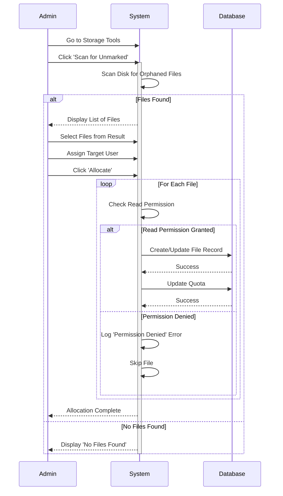

# Sequence Diagram: Use case 19 (Allocate unmarked files)

```mermaid
sequenceDiagram
    participant Admin
    participant System
    participant Database

    Admin->>System: Go to Storage Tools
    Admin->>System: Click 'Scan for Unmarked'
    
    activate System
    System->>System: Scan Disk for Orphaned Files
    
    alt Files Found
        System-->>Admin: Display List of Files
        Admin->>System: Select Files from Result
        Admin->>System: Assign Target User
        Admin->>System: Click 'Allocate'
        
        loop For Each File
            System->>System: Check Read Permission
            alt Read Permission Granted
                System->>Database: Create/Update File Record
                Database-->>System: Success
                System->>Database: Update Quota
                Database-->>System: Success
            else Permission Denied
                System->>System: Log 'Permission Denied' Error
                System->>System: Skip File
            end
        end
        
        System-->>Admin: Allocation Complete
        
    else No Files Found
        System-->>Admin: Display 'No Files Found'
    end
    deactivate System
```
