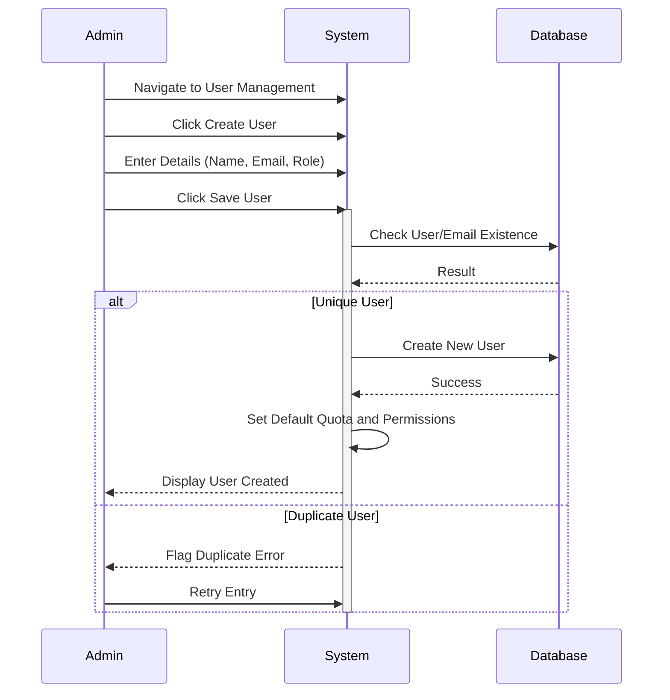

# Sequence Diagram: Use case 16 (Create user)

```mermaid
sequenceDiagram
    participant Admin
    participant System

    participant Database

    Admin->>System: Navigate to User Management
    Admin->>System: Click Create User
    Admin->>System: Enter Details (Name, Email, Role)
    Admin->>System: Click Save User
    
    activate System
    System->>Database: Check User/Email Existence
    Database-->>System: Result
    
    alt Unique User
        System->>Database: Create New User
        Database-->>System: Success
        System->>System: Set Default Quota and Permissions
        System-->>Admin: Display User Created
    else Duplicate User
        System-->>Admin: Flag Duplicate Error
        Admin->>System: Retry Entry
    end
    deactivate System
```
