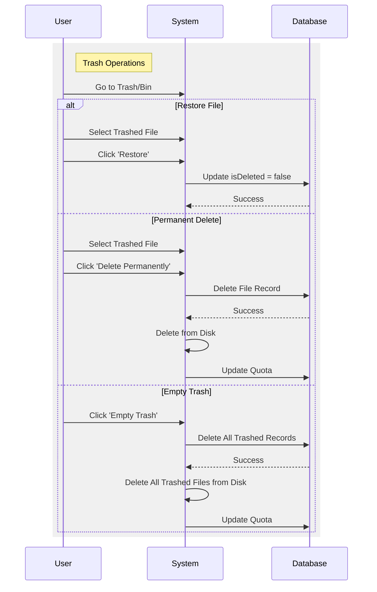

# Sequence Diagram: UC_DeleteFile (Trash Operations)

```mermaid
sequenceDiagram
    participant User
    participant System
    participant Database

    rect rgb(240, 240, 240)
        note right of User: Trash Operations
        User->>System: Go to Trash/Bin
        
        alt Restore File
            User->>System: Select Trashed File
            User->>System: Click 'Restore'
            System->>Database: Update isDeleted = false
            Database-->>System: Success
        else Permanent Delete
            User->>System: Select Trashed File
            User->>System: Click 'Delete Permanently'
            System->>Database: Delete File Record
            Database-->>System: Success
            System->>System: Delete from Disk
            System->>Database: Update Quota
        else Empty Trash
            User->>System: Click 'Empty Trash'
            System->>Database: Delete All Trashed Records
            Database-->>System: Success
            System->>System: Delete All Trashed Files from Disk
            System->>Database: Update Quota
        end
    end
```
