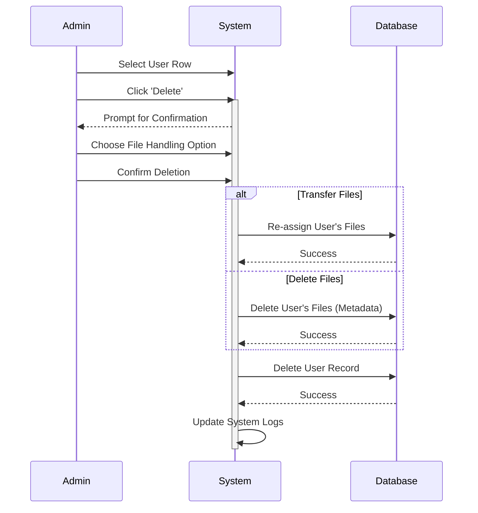

# Sequence Diagram: Use case 18 (Delete user)

```mermaid
sequenceDiagram
    participant Admin
    participant System

    participant Database

    Admin->>System: Select User Row
    Admin->>System: Click 'Delete'
    
    activate System
    System-->>Admin: Prompt for Confirmation
    Admin->>System: Choose File Handling Option
    Admin->>System: Confirm Deletion
    
    alt Transfer Files
        System->>Database: Re-assign User's Files
        Database-->>System: Success
    else Delete Files
        System->>Database: Delete User's Files (Metadata)
        Database-->>System: Success
    end
    
    System->>Database: Delete User Record
    Database-->>System: Success
    System->>System: Update System Logs
    deactivate System
```
