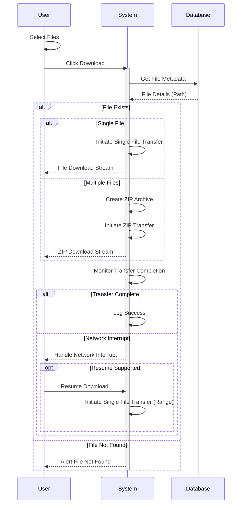

# Sequence Diagram: UC_Download (Download Files)

```mermaid
sequenceDiagram
    participant User
    participant System
    participant Database

    User->>User: Select Files
    User->>System: Click Download
    
    activate System
    System->>Database: Get File Metadata
    Database-->>System: File Details (Path)
    
    alt File Exists
        alt Single File
            System->>System: Initiate Single File Transfer
            System-->>User: File Download Stream
        else Multiple Files
            System->>System: Create ZIP Archive
            System->>System: Initiate ZIP Transfer
            System-->>User: ZIP Download Stream
        end
        
        System->>System: Monitor Transfer Completion
        
        alt Transfer Complete
            System->>System: Log Success
        else Network Interrupt
            System-->>User: Handle Network Interrupt
            
            opt Resume Supported
                User->>System: Resume Download
                System->>System: Initiate Single File Transfer (Range)
            end
        end
        
    else File Not Found
        System-->>User: Alert File Not Found
    end
    deactivate System
```
