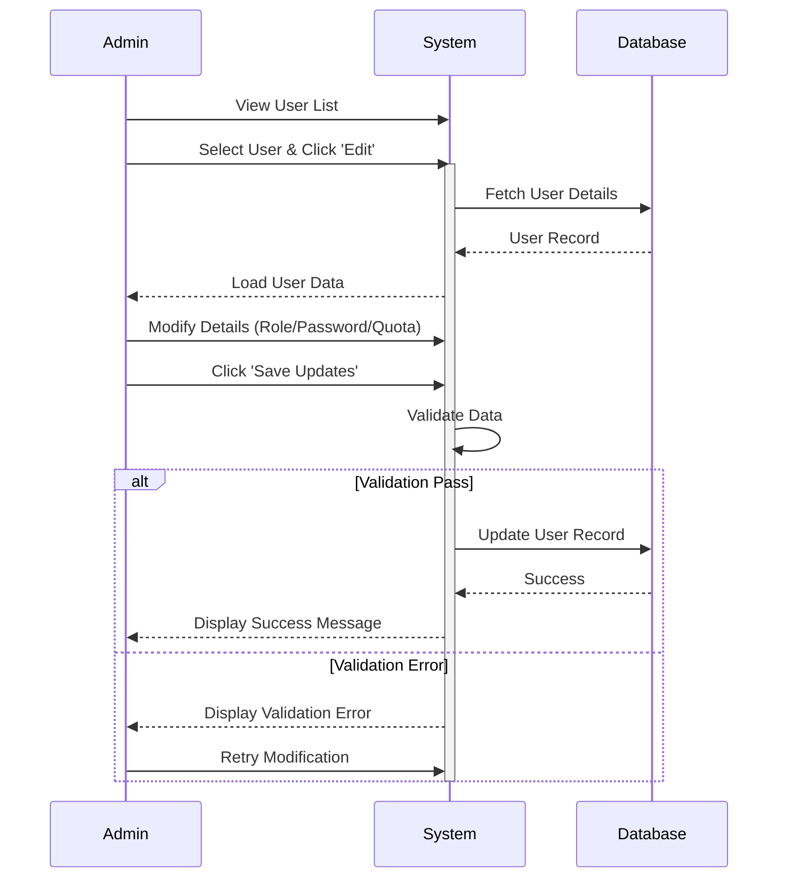

# Sequence Diagram: Use case 17 (Edit user)

```mermaid
sequenceDiagram
    participant Admin
    participant System

    participant Database

    Admin->>System: View User List
    Admin->>System: Select User & Click 'Edit'
    
    activate System
    System->>Database: Fetch User Details
    Database-->>System: User Record
    System-->>Admin: Load User Data
    Admin->>System: Modify Details (Role/Password/Quota)
    Admin->>System: Click 'Save Updates'
    
    System->>System: Validate Data
    
    alt Validation Pass
        System->>Database: Update User Record
        Database-->>System: Success
        System-->>Admin: Display Success Message
    else Validation Error
        System-->>Admin: Display Validation Error
        Admin->>System: Retry Modification
    end
    deactivate System
```
