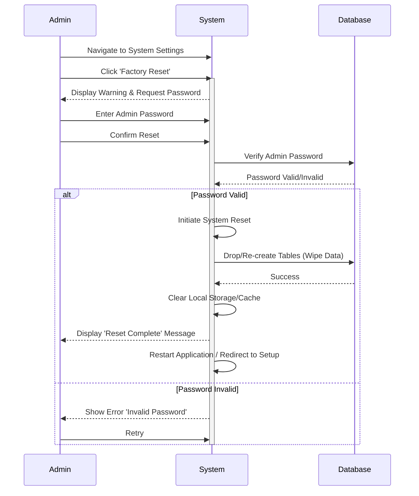

# Sequence Diagram: Use case 21 (Reset System / Factory Reset)

```mermaid
sequenceDiagram
    participant Admin
    participant System
    participant Database

    Admin->>System: Navigate to System Settings
    Admin->>System: Click 'Factory Reset'
    
    activate System
    System-->>Admin: Display Warning & Request Password
    Admin->>System: Enter Admin Password
    Admin->>System: Confirm Reset
    
    System->>Database: Verify Admin Password
    Database-->>System: Password Valid/Invalid
    
    alt Password Valid
        System->>System: Initiate System Reset
        System->>Database: Drop/Re-create Tables (Wipe Data)
        Database-->>System: Success
        System->>System: Clear Local Storage/Cache
        System-->>Admin: Display 'Reset Complete' Message
        System->>System: Restart Application / Redirect to Setup
    else Password Invalid
        System-->>Admin: Show Error 'Invalid Password'
        Admin->>System: Retry
    end
    deactivate System
```
