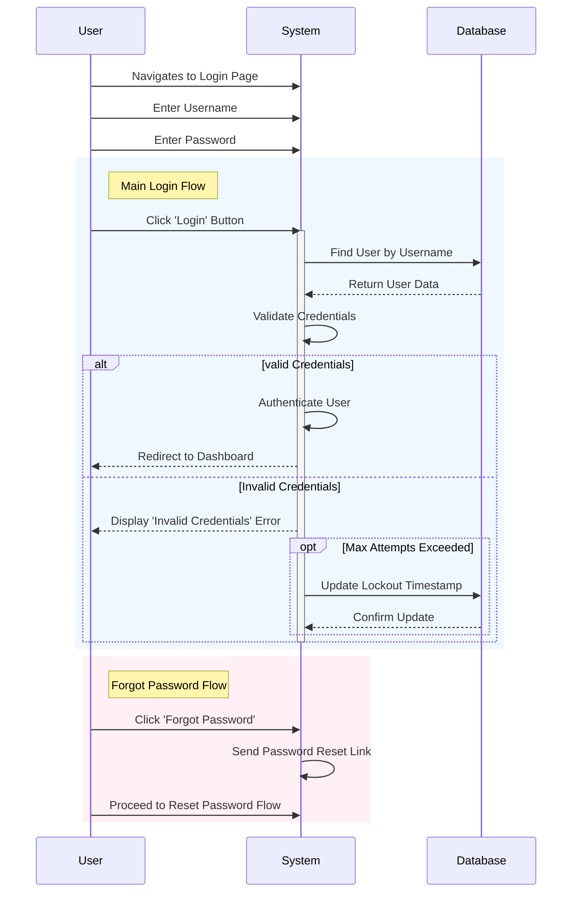

# Sequence Diagram: UC_Login

```mermaid
sequenceDiagram
    participant User
    participant System

    participant Database

    User->>System: Navigates to Login Page
    User->>System: Enter Username
    User->>System: Enter Password
    
    rect rgb(240, 248, 255)
        note right of User: Main Login Flow
        User->>System: Click 'Login' Button
        activate System
        System->>Database: Find User by Username
        Database-->>System: Return User Data
        System->>System: Validate Credentials
        
        alt valid Credentials
            System->>System: Authenticate User
            System-->>User: Redirect to Dashboard
        else Invalid Credentials
            System-->>User: Display 'Invalid Credentials' Error
            
            opt Max Attempts Exceeded
                System->>Database: Update Lockout Timestamp
                Database-->>System: Confirm Update
            end
        end
        deactivate System
    end

    rect rgb(255, 240, 245)
        note right of User: Forgot Password Flow
        User->>System: Click 'Forgot Password'
        System->>System: Send Password Reset Link
        User->>System: Proceed to Reset Password Flow
    end
```
