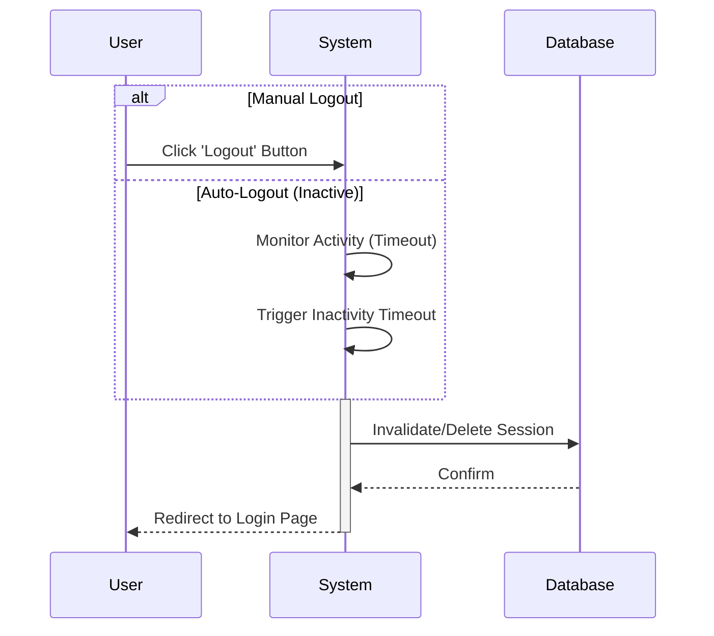

# Sequence Diagram: UC_Logout (Logout)

```mermaid
sequenceDiagram
    participant User
    participant System
    participant Database

    alt Manual Logout
        User->>System: Click 'Logout' Button
    else Auto-Logout (Inactive)
        System->>System: Monitor Activity (Timeout)
        System->>System: Trigger Inactivity Timeout
    end
    
    activate System
    System->>Database: Invalidate/Delete Session
    Database-->>System: Confirm
    System-->>User: Redirect to Login Page
    deactivate System
```
