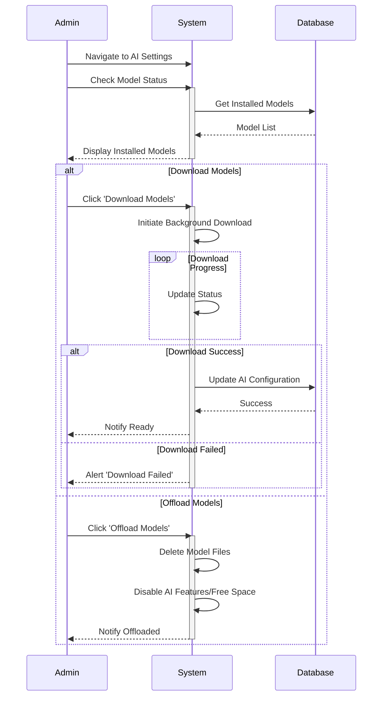

# Sequence Diagram: Use case 20 (Manage AI features)

```mermaid
sequenceDiagram
    participant Admin
    participant System
    participant Database

    Admin->>System: Navigate to AI Settings
    Admin->>System: Check Model Status
    activate System
    System->>Database: Get Installed Models
    Database-->>System: Model List
    System-->>Admin: Display Installed Models
    deactivate System

    alt Download Models
        Admin->>System: Click 'Download Models'
        activate System
        System->>System: Initiate Background Download
        
        loop Download Progress
            System->>System: Update Status
        end
        
        alt Download Success
            System->>Database: Update AI Configuration
            Database-->>System: Success
            System-->>Admin: Notify Ready
        else Download Failed
            System-->>Admin: Alert 'Download Failed'
        end
        deactivate System
        
    else Offload Models
        Admin->>System: Click 'Offload Models'
        activate System
        System->>System: Delete Model Files
        System->>System: Disable AI Features/Free Space
        System-->>Admin: Notify Offloaded
        deactivate System
    end
```
