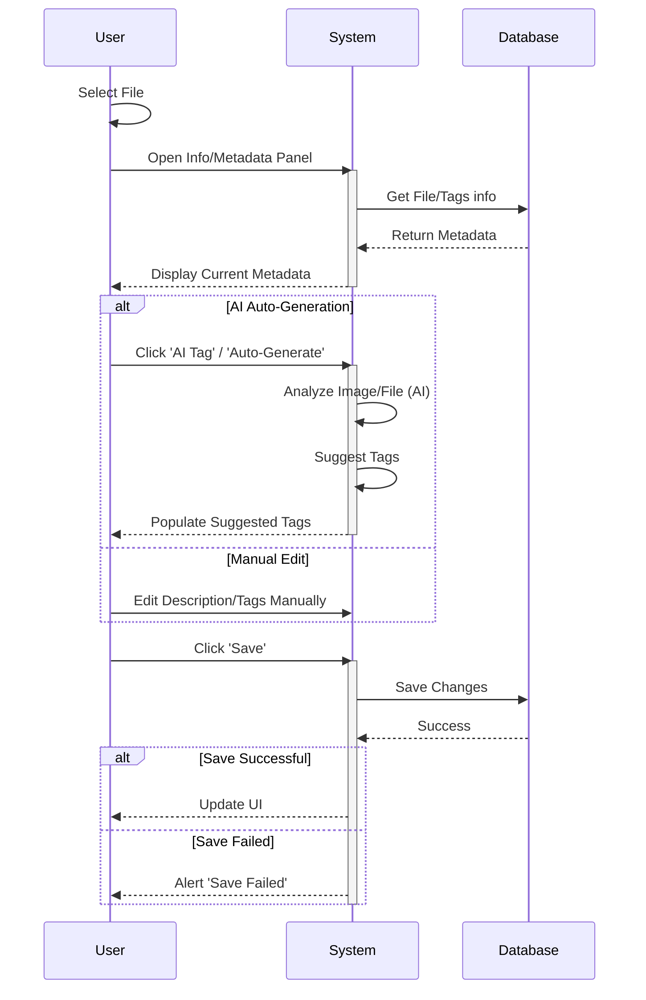

# Sequence Diagram: UC_Meta (Edit Metadata/Tags)

```mermaid
sequenceDiagram
    participant User
    participant System
    participant Database

    User->>User: Select File
    User->>System: Open Info/Metadata Panel
    
    activate System
    System->>Database: Get File/Tags info
    Database-->>System: Return Metadata
    System-->>User: Display Current Metadata
    deactivate System

    alt AI Auto-Generation
        User->>System: Click 'AI Tag' / 'Auto-Generate'
        activate System
        System->>System: Analyze Image/File (AI)
        System->>System: Suggest Tags
        System-->>User: Populate Suggested Tags
        deactivate System
    else Manual Edit
        User->>System: Edit Description/Tags Manually
    end
    
    User->>System: Click 'Save'
    
    activate System
    System->>Database: Save Changes
    Database-->>System: Success
    
    alt Save Successful
        System-->>User: Update UI
    else Save Failed
        System-->>User: Alert 'Save Failed'
    end
    deactivate System
```
