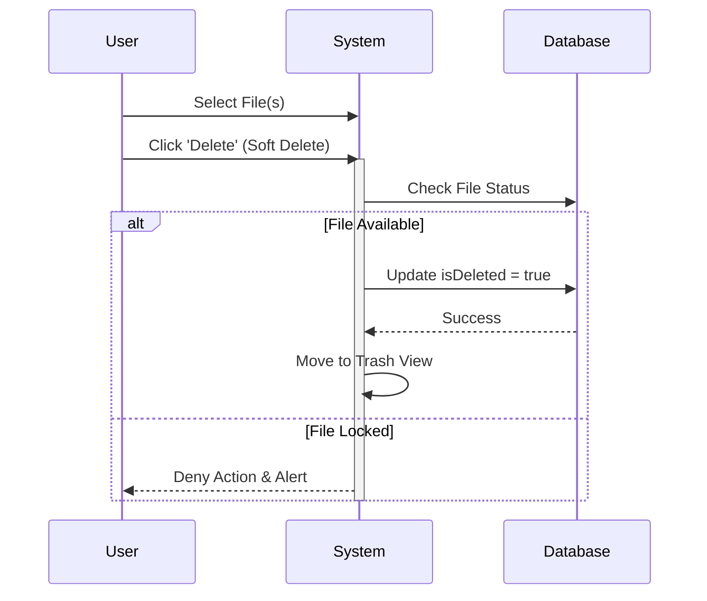

# Sequence Diagram: UC_MoveToTrash (Soft Delete)

```mermaid
sequenceDiagram
    participant User
    participant System
    participant Database

    User->>System: Select File(s)
    User->>System: Click 'Delete' (Soft Delete)
    
    activate System
    System->>Database: Check File Status
    
    alt File Available
        System->>Database: Update isDeleted = true
        Database-->>System: Success
        System->>System: Move to Trash View
    else File Locked
        System-->>User: Deny Action & Alert
    end
    deactivate System
```
