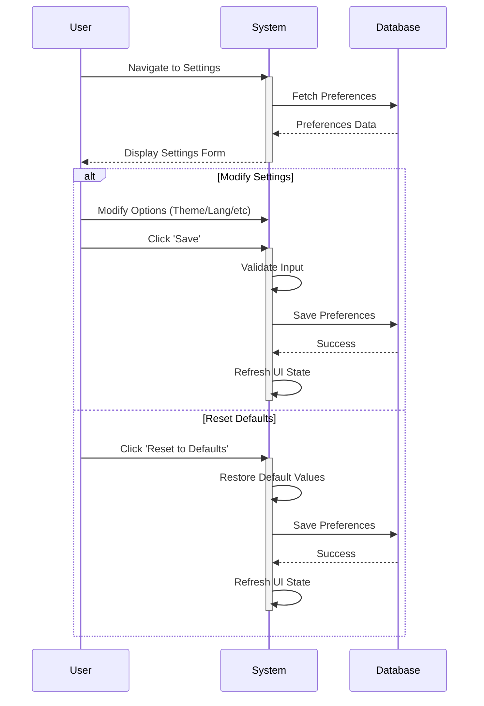

# Sequence Diagram: UC_Prefs (Manage Preferences)

```mermaid
sequenceDiagram
    participant User
    participant System
    participant Database

    User->>System: Navigate to Settings
    activate System
    System->>Database: Fetch Preferences
    Database-->>System: Preferences Data
    System-->>User: Display Settings Form
    deactivate System
    
    alt Modify Settings
        User->>System: Modify Options (Theme/Lang/etc)
        User->>System: Click 'Save'
        
        activate System
        System->>System: Validate Input
        System->>Database: Save Preferences
        Database-->>System: Success
        System->>System: Refresh UI State
        deactivate System
        
    else Reset Defaults
        User->>System: Click 'Reset to Defaults'
        activate System
        System->>System: Restore Default Values
        System->>Database: Save Preferences
        Database-->>System: Success
        System->>System: Refresh UI State
        deactivate System
    end
```
