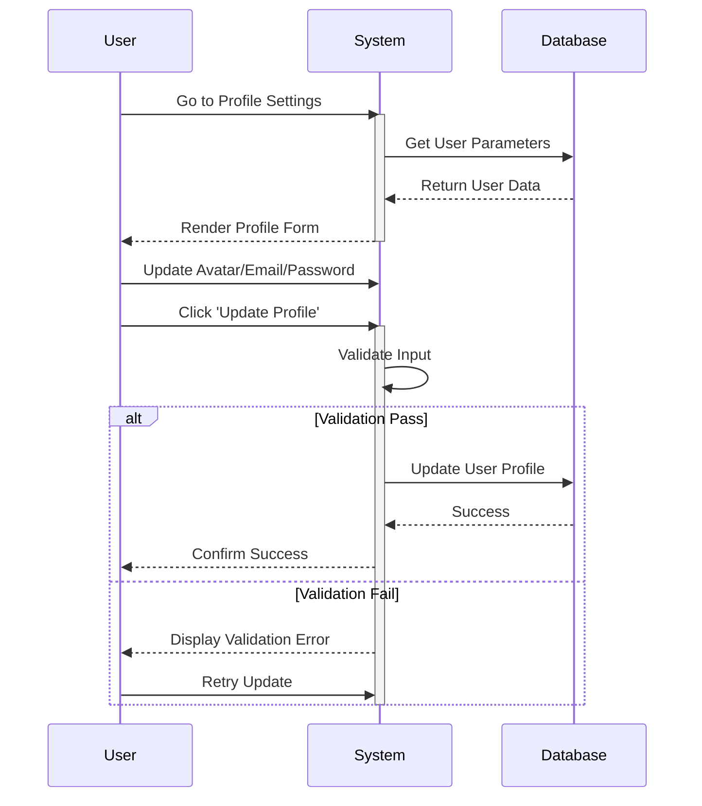

# Sequence Diagram: UC_Profile (Update Profile)

```mermaid
sequenceDiagram
    participant User
    participant System

    participant Database

    User->>System: Go to Profile Settings
    activate System
    System->>Database: Get User Parameters
    Database-->>System: Return User Data
    System-->>User: Render Profile Form
    deactivate System
    
    User->>System: Update Avatar/Email/Password
    User->>System: Click 'Update Profile'
    
    activate System
    System->>System: Validate Input
    
    alt Validation Pass
        System->>Database: Update User Profile
        Database-->>System: Success
        System-->>User: Confirm Success
    else Validation Fail
        System-->>User: Display Validation Error
        User->>System: Retry Update
    end
    deactivate System
```
