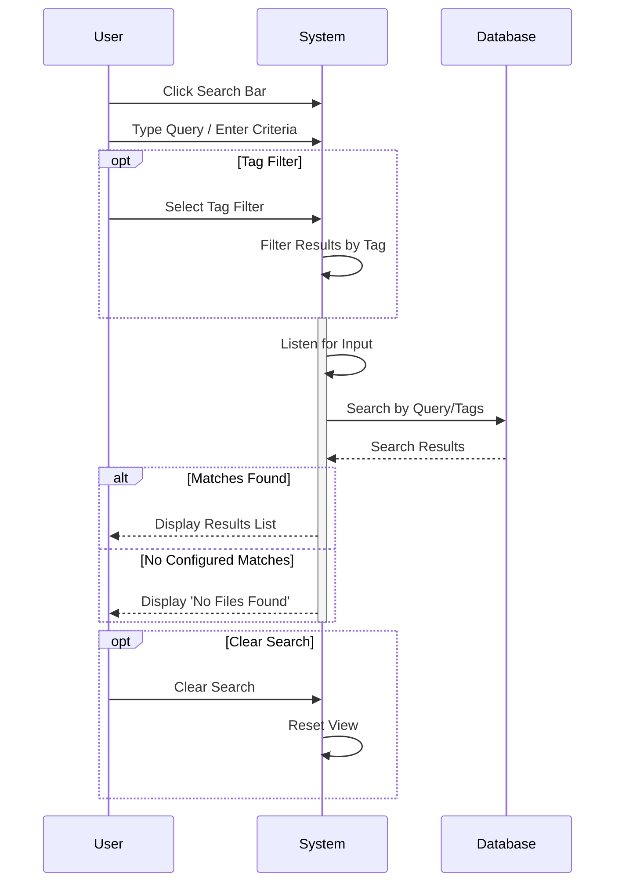

# Sequence Diagram: UC_Search (Search Files)

```mermaid
sequenceDiagram
    participant User
    participant System
    participant Database

    User->>System: Click Search Bar
    User->>System: Type Query / Enter Criteria
    
    opt Tag Filter
        User->>System: Select Tag Filter
        System->>System: Filter Results by Tag
    end 
    
    activate System
    System->>System: Listen for Input
    System->>Database: Search by Query/Tags
    Database-->>System: Search Results
    
    alt Matches Found
        System-->>User: Display Results List
    else No Configured Matches
        System-->>User: Display 'No Files Found'
    end
    deactivate System
    
    opt Clear Search
        User->>System: Clear Search
        System->>System: Reset View
    end
```
