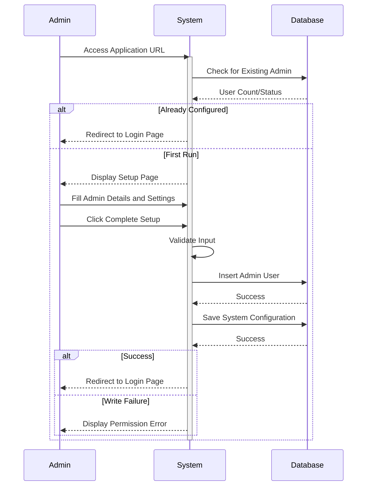

# Sequence Diagram: UC_Setup (Initial Setup)

```mermaid
sequenceDiagram
    participant Admin
    participant System
    participant Database

    Admin->>System: Access Application URL
    
    activate System
    System->>Database: Check for Existing Admin
    Database-->>System: User Count/Status
    
    alt Already Configured
        System-->>Admin: Redirect to Login Page
    else First Run
        System-->>Admin: Display Setup Page
        Admin->>System: Fill Admin Details and Settings
        Admin->>System: Click Complete Setup
        
        System->>System: Validate Input
        System->>Database: Insert Admin User
        Database-->>System: Success
        System->>Database: Save System Configuration
        Database-->>System: Success
        
        alt Success
            System-->>Admin: Redirect to Login Page
        else Write Failure
            System-->>Admin: Display Permission Error
        end
    end
    deactivate System
```
