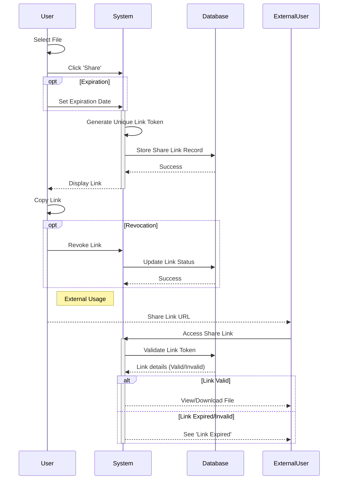

# Sequence Diagram: UC_Share (Share Links)

```mermaid
sequenceDiagram
    participant User
    participant System
    participant Database
    participant ExternalUser

    User->>User: Select File
    User->>System: Click 'Share'
    
    opt Expiration
        User->>System: Set Expiration Date
    end
    
    activate System
    System->>System: Generate Unique Link Token
    System->>Database: Store Share Link Record
    Database-->>System: Success
    System-->>User: Display Link
    deactivate System
    
    User->>User: Copy Link
    
    opt Revocation
        User->>System: Revoke Link
        System->>Database: Update Link Status
        Database-->>System: Success
    end
    
    note right of User: External Usage
    User-->>ExternalUser: Share Link URL
    ExternalUser->>System: Access Share Link
    
    activate System
    System->>Database: Validate Link Token
    Database-->>System: Link details (Valid/Invalid)
    
    alt Link Valid
        System-->>ExternalUser: View/Download File
    else Link Expired/Invalid
        System-->>ExternalUser: See 'Link Expired'
    end
    deactivate System
```
