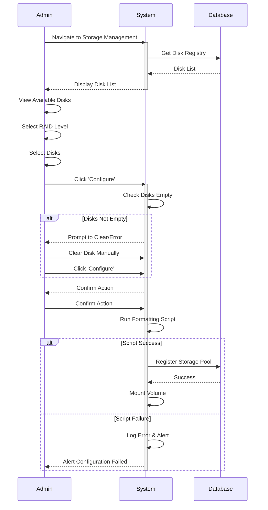

# Sequence Diagram: UC_StorageMgmt (Storage Management)

```mermaid
sequenceDiagram
    participant Admin
    participant System
    participant Database

    Admin->>System: Navigate to Storage Management
    activate System
    System->>Database: Get Disk Registry
    Database-->>System: Disk List
    System-->>Admin: Display Disk List
    deactivate System
    
    Admin->>Admin: View Available Disks
    Admin->>Admin: Select RAID Level
    Admin->>Admin: Select Disks
    Admin->>System: Click 'Configure'
    
    activate System
    System->>System: Check Disks Empty
    
    alt Disks Not Empty
        System-->>Admin: Prompt to Clear/Error
        Admin->>System: Clear Disk Manually
        Admin->>System: Click 'Configure'
    end
    
    System-->>Admin: Confirm Action
    Admin->>System: Confirm Action
    
    System->>System: Run Formatting Script
    
    alt Script Success
        System->>Database: Register Storage Pool
        Database-->>System: Success
        System->>System: Mount Volume
    else Script Failure
        System->>System: Log Error & Alert
        System-->>Admin: Alert Configuration Failed
    end
    deactivate System
```
