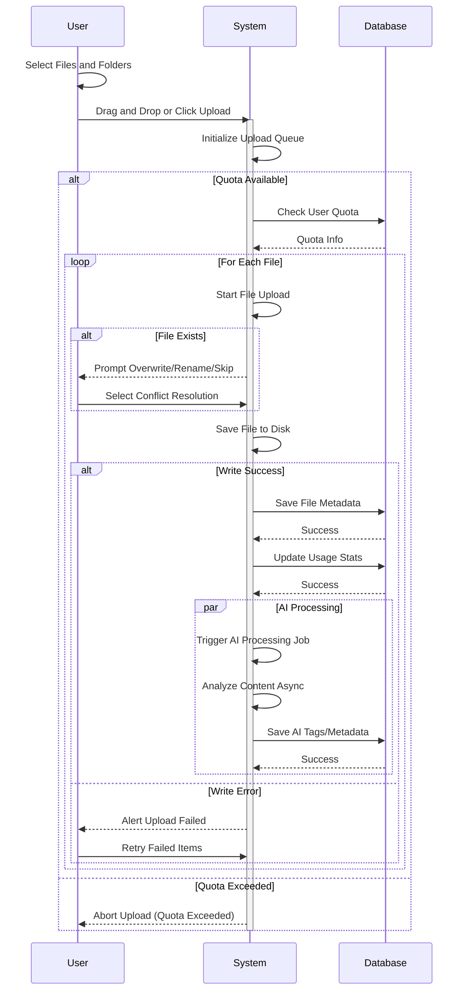

# Sequence Diagram: UC_Upload (Upload Files)

```mermaid
sequenceDiagram
    participant User
    participant System
    participant Database

    User->>User: Select Files and Folders
    User->>System: Drag and Drop or Click Upload
    
    activate System
    System->>System: Initialize Upload Queue
    
    alt Quota Available
        System->>Database: Check User Quota
        Database-->>System: Quota Info
        
        loop For Each File
            System->>System: Start File Upload
            
            alt File Exists
                System-->>User: Prompt Overwrite/Rename/Skip
                User->>System: Select Conflict Resolution
            end
            
            System->>System: Save File to Disk
            
            alt Write Success
                System->>Database: Save File Metadata
                Database-->>System: Success
                System->>Database: Update Usage Stats
                Database-->>System: Success
                
                par AI Processing
                    System->>System: Trigger AI Processing Job
                    System->>System: Analyze Content Async
                    System->>Database: Save AI Tags/Metadata
                    Database-->>System: Success
                end
            else Write Error
                System-->>User: Alert Upload Failed
                User->>System: Retry Failed Items
            end
        end
        
    else Quota Exceeded
        System-->>User: Abort Upload (Quota Exceeded)
    end
    deactivate System
```
