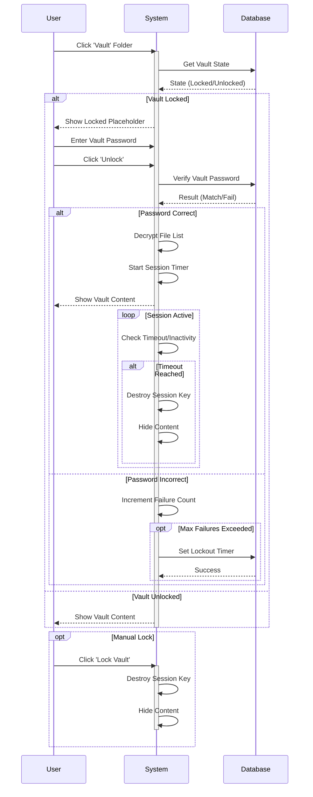

# Sequence Diagram: UC_VaultLock (Encrypted File Access)

```mermaid
sequenceDiagram
    participant User
    participant System
    participant Database

    User->>System: Click 'Vault' Folder
    activate System
    System->>Database: Get Vault State
    Database-->>System: State (Locked/Unlocked)
    
    alt Vault Locked
        System-->>User: Show Locked Placeholder
        User->>System: Enter Vault Password
        User->>System: Click 'Unlock'
        
        System->>Database: Verify Vault Password
        Database-->>System: Result (Match/Fail)
        
        alt Password Correct
            System->>System: Decrypt File List
            System->>System: Start Session Timer
            System-->>User: Show Vault Content
            
            loop Session Active
                 System->>System: Check Timeout/Inactivity
                 alt Timeout Reached
                     System->>System: Destroy Session Key
                     System->>System: Hide Content
                 end
            end
            
        else Password Incorrect
            System->>System: Increment Failure Count
            
            opt Max Failures Exceeded
                System->>Database: Set Lockout Timer
                Database-->>System: Success
            end
        end
        
    else Vault Unlocked
        System-->>User: Show Vault Content
    end
    deactivate System

    opt Manual Lock
        User->>System: Click 'Lock Vault'
        activate System
        System->>System: Destroy Session Key
        System->>System: Hide Content
        deactivate System
    end
```
